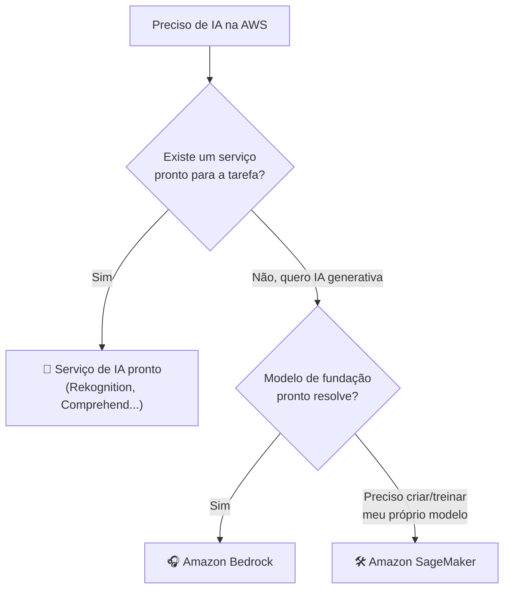

# Módulo 07 · Amazon SageMaker e os serviços de IA da AWS

> **Domínio:** 3 · Aplicações de Modelos · **Tempo estimado:** 2h30 · **Pré-requisitos:** Módulo 06

## 🎯 Objetivos de aprendizagem

Ao final deste módulo, você será capaz de:

- Entender o que é o **Amazon SageMaker** e para quem ele serve.
- Reconhecer os **serviços de IA prontos** da AWS (Rekognition, Comprehend, etc.).
- Escolher entre serviço pronto, Bedrock ou SageMaker.

 

---

 

## 🧠 Conteúdo

 

### 1. Amazon SageMaker — a oficina completa de ML

O **Amazon SageMaker** é a plataforma da AWS para **construir, treinar e implantar** modelos de machine learning do zero, com controle total. É a "oficina completa" para quem quer criar seus próprios modelos.

> [!TIP]
> Se o Bedrock é o "streaming de modelos prontos", o SageMaker é a **cozinha profissional**: você tem todas as ferramentas para criar sua própria receita de modelo, do preparo dos dados ao prato final.

Ele cobre todo o ciclo de ML ([Módulo 02](../dominio-1-fundamentos-de-ia-e-ml/02-ciclo-de-vida-ml.md)): preparar dados, treinar, avaliar, implantar e monitorar.

 

### 2. Serviços de IA prontos: nem sempre você precisa treinar

Às vezes você quer o resultado sem treinar nada. A AWS tem **serviços de IA prontos** (pré-treinados) que resolvem tarefas comuns com uma simples chamada de API:

| Serviço | O que faz |
|:--|:--|
| 👁️ **Amazon Rekognition** | Análise de **imagens e vídeos** (detectar objetos, rostos, texto). |
| 💬 **Amazon Comprehend** | Análise de **texto** (sentimento, entidades, idioma). |
| 🗣️ **Amazon Transcribe** | Converte **fala em texto** (transcrição). |
| 🔊 **Amazon Polly** | Converte **texto em fala** (voz). |
| 🌐 **Amazon Translate** | **Tradução** automática entre idiomas. |
| 📄 **Amazon Textract** | Extrai **texto e dados de documentos** (formulários, tabelas). |
| 🤖 **Amazon Lex** | Cria **chatbots** e assistentes de voz. |
| 🛒 **Amazon Personalize** | Gera **recomendações** personalizadas. |
| 🔎 **Amazon Kendra** | **Busca inteligente** em documentos empresariais. |

> [!IMPORTANT]
> A prova adora perguntar "qual serviço para X tarefa". Macete pelos nomes:
> - **Imagem/vídeo** → **Rekognition**.
> - **Texto/sentimento** → **Comprehend**.
> - **Fala → texto** → **Transcribe**; **texto → fala** → **Polly**.
> - **Documentos** → **Textract**.
> - **Chatbot** → **Lex**.
> - **Recomendações** → **Personalize**.

 

### 3. Como escolher: os três níveis

| Nível | Quando usar | Esforço |
|:--|:--|:--|
| 🧰 **Serviços prontos** | A tarefa é comum (imagem, texto, voz). | Mínimo |
| 🎧 **Amazon Bedrock** | Quero IA generativa com modelos prontos. | Baixo |
| 🛠️ **Amazon SageMaker** | Preciso de um modelo próprio, sob medida. | Alto (controle total) |

> [!TIP]
> Comece sempre pelo **mais simples** que resolve: se um serviço pronto atende, não reinvente a roda com SageMaker.

 

---

 

## ❓ Quiz — teste seus conhecimentos

 

**1. Para que serve o Amazon SageMaker?**

- **A)** Apenas para traduzir textos.
- **B)** Para construir, treinar e implantar modelos de ML do zero, com controle total.
- **C)** Para armazenar objetos.
- **D)** Para gerenciar faturas.

💡 Ver resposta

> ✅ **Resposta: B)** — O **SageMaker** é a plataforma completa para **criar seus próprios modelos** de ML.

 

**2. Você precisa detectar objetos e rostos em imagens. Qual serviço usar?**

- **A)** Amazon Comprehend.
- **B)** Amazon Rekognition.
- **C)** Amazon Polly.
- **D)** Amazon Translate.

💡 Ver resposta

> ✅ **Resposta: B)** — **Rekognition** é o serviço de análise de **imagens e vídeos**.

 

**3. Você quer analisar o sentimento de comentários de texto. Qual serviço?**

- **A)** Amazon Comprehend.
- **B)** Amazon Transcribe.
- **C)** Amazon Textract.
- **D)** Amazon Rekognition.

💡 Ver resposta

> ✅ **Resposta: A)** — **Comprehend** analisa **texto** (sentimento, entidades, idioma).

 

**4. Qual serviço converte fala em texto (transcrição)?**

- **A)** Amazon Polly.
- **B)** Amazon Transcribe.
- **C)** Amazon Lex.
- **D)** Amazon Translate.

💡 Ver resposta

> ✅ **Resposta: B)** — **Transcribe** faz **fala → texto**. (Polly faz o inverso: texto → fala.)

 

**5. Você quer criar um chatbot de atendimento. Qual serviço pronto usar?**

- **A)** Amazon Lex.
- **B)** Amazon Textract.
- **C)** Amazon Personalize.
- **D)** Amazon Kendra.

💡 Ver resposta

> ✅ **Resposta: A)** — **Amazon Lex** cria **chatbots** e assistentes de voz.

 

---

 

## 🧪 Mão na massa (sem console!)

- 🔗 **AWS Skill Builder** → procure por *"Amazon SageMaker"* e *"AWS AI Services"*.
- 🔗 Para 5 tarefas (transcrever aula, moderar imagens, traduzir posts, extrair dados de PDFs, recomendar conteúdo), escolha o serviço pronto ideal.

 

---

 

## 📔 Glossário

| Termo | Significado |
|:--|:--|
| **Amazon SageMaker** | Plataforma para criar, treinar e implantar modelos de ML. |
| **Rekognition** | Análise de imagens e vídeos. |
| **Comprehend** | Análise de texto (sentimento, entidades). |
| **Transcribe / Polly** | Fala↔texto (transcrição / síntese de voz). |
| **Translate** | Tradução automática. |
| **Textract** | Extração de dados de documentos. |
| **Lex** | Criação de chatbots. |
| **Personalize / Kendra** | Recomendações / busca inteligente. |

 

## ✅ Checklist de conclusão

- [ ] Li todo o conteúdo do módulo
- [ ] Entendo o que é o SageMaker
- [ ] Reconheço os principais serviços de IA prontos
- [ ] Sei escolher entre serviço pronto, Bedrock e SageMaker
- [ ] Fiz o quiz
- [ ] Registrei meu [Checkpoint](https://github.com/melissaalves-stack/awscloudfoundations/issues/new?template=checkpoint-de-modulo.yml)

 

---

**Precisa de ajuda?** 📊 [Checkpoint](https://github.com/melissaalves-stack/awscloudfoundations/issues/new?template=checkpoint-de-modulo.yml) · ❓ [Dúvida](https://github.com/melissaalves-stack/awscloudfoundations/issues/new?template=duvida.yml) · 📖 [Guia](../../GUIA-DO-ALUNO.md) · 🚀 [Builder Center](https://bit.ly/4w720IR)

⬅️ [Módulo 06](./06-amazon-bedrock.md) &nbsp;·&nbsp; 🏠 [Índice do Domínio 3](./README.md) &nbsp;·&nbsp; ➡️ [Módulo 08 · RAG e ajuste fino](./08-rag-e-ajuste-fino.md)

