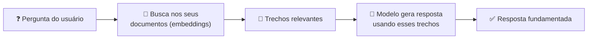
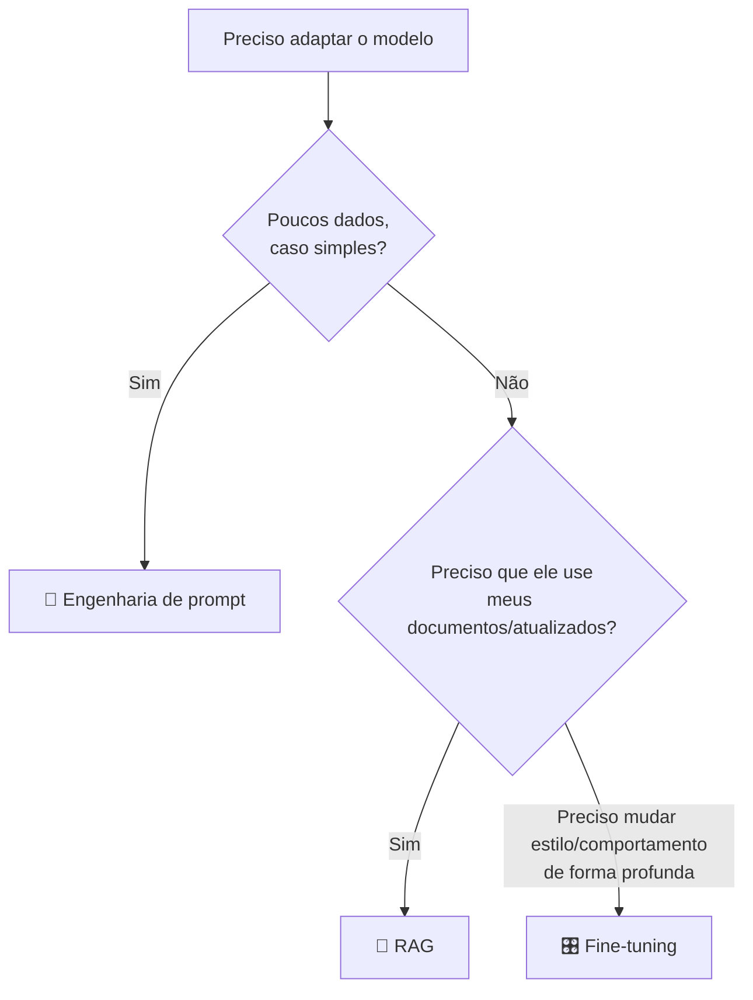

# Módulo 08 · Personalizando modelos: RAG e ajuste fino

> **Domínio:** 3 · Aplicações de Modelos · **Tempo estimado:** 3h · **Pré-requisitos:** Módulos 06 e 07

## 🎯 Objetivos de aprendizagem

Ao final deste módulo, você será capaz de:

- Entender o que é **RAG (Retrieval-Augmented Generation)**.
- Explicar o que é **ajuste fino (fine-tuning)**.
- Escolher entre **prompt, RAG e fine-tuning** para cada necessidade.

 

---

 

## 🧠 Conteúdo

 

### 1. O problema: o modelo não conhece os SEUS dados

Um modelo de fundação sabe muito sobre o mundo, mas **não** conhece os documentos internos da sua Liga, o catálogo da sua empresa ou notícias após o treino dele. Como resolver? Há três caminhos, do mais leve ao mais pesado.

 

### 2. Caminho 1: Engenharia de prompt (já vimos!)

Você **coloca a informação no próprio prompt**. Simples, rápido, sem custo de treino — mas limitado pela janela de contexto e ideal para poucos dados.

 

### 3. Caminho 2: RAG — dar uma "consulta" ao modelo

**RAG (Retrieval-Augmented Generation)** = "Geração Aumentada por Recuperação". A ideia: antes de responder, o sistema **busca** os trechos mais relevantes dos **seus** documentos e os entrega ao modelo como contexto.

> [!TIP]
> **Analogia da prova com consulta** 📖
> Sem RAG, o modelo responde "de cabeça". Com RAG, é como deixá-lo **consultar o material** na hora da prova: ele busca a informação certa nos seus dados e responde com base nela.

> [!IMPORTANT]
> Vantagens do RAG: reduz **alucinações**, usa dados **atualizados** e **não exige re-treinar** o modelo. Usa **embeddings** ([Módulo 04](../dominio-2-fundamentos-de-ia-generativa/04-llms-tokens-embeddings.md)) para achar os trechos por significado. Na AWS, as **Knowledge Bases do Bedrock** implementam RAG.

 

### 4. Caminho 3: Ajuste fino (fine-tuning) — re-ensinar o modelo

O **ajuste fino** pega um modelo de fundação e o **treina um pouco mais** com os **seus** exemplos, para que ele aprenda um estilo, um domínio ou um formato específico.

> [!NOTE]
> O fine-tuning **muda os pesos** do modelo. É mais poderoso, porém mais **caro e trabalhoso** (precisa de dados de qualidade e treino). Use quando prompt e RAG não bastam — por exemplo, para adotar um tom de voz muito específico da marca.

 

### 5. Qual escolher?

| Técnica | Muda o modelo? | Custo | Melhor para |
|:--|:--:|:--:|:--|
| 📝 **Prompt** | Não | 💵 | Ajustes rápidos, poucos dados |
| 🔎 **RAG** | Não | 💵💵 | Usar seus dados atualizados, reduzir alucinação |
| 🎛️ **Fine-tuning** | Sim | 💵💵💵 | Estilo/comportamento específico e profundo |

> [!TIP]
> Regra de ouro: comece pelo **prompt**. Se precisar dos seus dados, use **RAG**. Só parta para **fine-tuning** se realmente precisar mudar o comportamento do modelo — é o mais caro.

 

---

 

## ❓ Quiz — teste seus conhecimentos

 

**1. O que é RAG (Retrieval-Augmented Generation)?**

- **A)** Um tipo de instância EC2.
- **B)** Buscar trechos relevantes dos seus dados e entregá-los ao modelo como contexto antes de responder.
- **C)** Re-treinar o modelo do zero.
- **D)** Um serviço de armazenamento.

💡 Ver resposta

> ✅ **Resposta: B)** — **RAG** recupera informação dos seus documentos e a fornece ao modelo, fundamentando a resposta.

 

**2. Qual é uma grande vantagem do RAG?**

- **A)** Reduzir alucinações e usar dados atualizados sem re-treinar o modelo.
- **B)** Eliminar a necessidade de dados.
- **C)** Deixar o modelo mais lento de propósito.
- **D)** Substituir o IAM.

💡 Ver resposta

> ✅ **Resposta: A)** — O RAG **reduz alucinações** e usa **dados atualizados**, sem precisar re-treinar o modelo.

 

**3. O que o ajuste fino (fine-tuning) faz?**

- **A)** Apenas coloca dados no prompt.
- **B)** Treina o modelo um pouco mais com seus exemplos, mudando seus pesos.
- **C)** Apaga o modelo.
- **D)** Cria um bucket S3.

💡 Ver resposta

> ✅ **Resposta: B)** — O **fine-tuning** re-treina o modelo com seus dados, **alterando seus pesos**.

 

**4. Você quer que o modelo responda com base em documentos internos ATUALIZADOS, sem re-treiná-lo. Qual técnica?**

- **A)** Fine-tuning.
- **B)** RAG.
- **C)** Nenhuma serve.
- **D)** Apenas aumentar a temperatura.

💡 Ver resposta

> ✅ **Resposta: B)** — **RAG** é ideal para usar dados internos e atualizados sem re-treinar o modelo.

 

**5. Qual a ordem recomendada para adaptar um modelo, do mais simples ao mais custoso?**

- **A)** Fine-tuning → RAG → Prompt.
- **B)** Prompt → RAG → Fine-tuning.
- **C)** RAG → Prompt → Fine-tuning.
- **D)** Tanto faz.

💡 Ver resposta

> ✅ **Resposta: B)** — Comece pelo **prompt**, depois **RAG**, e só então **fine-tuning** (o mais caro e trabalhoso).

 

---

 

## 🧪 Mão na massa (sem console!)

- 🔗 **AWS Skill Builder** → procure por *"Retrieval Augmented Generation"* e *"Fine-tuning"*.
- 🔗 Pense em um chatbot de dúvidas da Liga: ele precisaria de prompt, RAG ou fine-tuning? Justifique.

 

---

 

## 📔 Glossário

| Termo | Significado |
|:--|:--|
| **RAG** | Recuperar dados relevantes e fornecê-los ao modelo antes de responder. |
| **Knowledge Base** | Recurso do Bedrock que implementa RAG com seus dados. |
| **Fine-tuning** | Re-treinar um modelo com seus exemplos, mudando seus pesos. |
| **Engenharia de prompt** | Colocar informação/instrução no próprio prompt. |
| **Alucinação** | Resposta plausível, porém falsa (RAG ajuda a reduzir). |

 

## ✅ Checklist de conclusão

- [ ] Li todo o conteúdo do módulo
- [ ] Entendo o que é RAG e suas vantagens
- [ ] Entendo o que é fine-tuning
- [ ] Sei escolher entre prompt, RAG e fine-tuning
- [ ] Associo RAG às Knowledge Bases do Bedrock
- [ ] Fiz o quiz
- [ ] Registrei meu [Checkpoint](https://github.com/melissaalves-stack/awscloudfoundations/issues/new?template=checkpoint-de-modulo.yml)

 

---

**Precisa de ajuda?** 📊 [Checkpoint](https://github.com/melissaalves-stack/awscloudfoundations/issues/new?template=checkpoint-de-modulo.yml) · ❓ [Dúvida](https://github.com/melissaalves-stack/awscloudfoundations/issues/new?template=duvida.yml) · 📖 [Guia](../../GUIA-DO-ALUNO.md) · 🚀 [Builder Center](https://bit.ly/4w720IR)

⬅️ [Módulo 07](./07-sagemaker-e-servicos-de-ia.md) &nbsp;·&nbsp; 🏠 [Índice do Domínio 3](./README.md) &nbsp;·&nbsp; ➡️ [Módulo 09 · Agentes e avaliação](./09-agentes-e-avaliacao.md)

