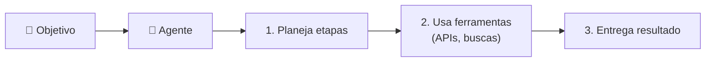

# Módulo 09 · Agentes e avaliação de modelos

> **Domínio:** 3 · Aplicações de Modelos · **Tempo estimado:** 2h30 · **Pré-requisitos:** Módulos 06 a 08

## 🎯 Objetivos de aprendizagem

Ao final deste módulo, você será capaz de:

- Entender o que são **agentes** de IA.
- Conhecer formas de **avaliar** modelos generativos.
- Reconhecer métricas e critérios de qualidade.

 

---

 

## 🧠 Conteúdo

 

### 1. Agentes: IA que executa tarefas

Um **agente** de IA vai além de responder: ele **planeja e executa** tarefas em várias etapas, podendo **usar ferramentas** (chamar APIs, consultar bancos, fazer buscas) para atingir um objetivo.

> [!TIP]
> **Analogia do assistente pessoal** 🧑‍💼
> Um LLM comum é como um consultor que **responde** perguntas. Um **agente** é como um assistente que **age**: você diz "organize minha viagem" e ele pesquisa voos, compara preços e monta o roteiro — usando ferramentas para cada passo.

Na AWS, os **Agents for Amazon Bedrock** permitem criar esses agentes que quebram um pedido em etapas e chamam serviços para completá-las.

 

### 2. Por que avaliar um modelo?

Modelos generativos não têm uma única "resposta certa", então avaliá-los é mais sutil do que no ML tradicional. Precisamos checar se as respostas são **úteis, corretas, seguras e adequadas**.

 

### 3. Formas de avaliação

| Abordagem | Como funciona |
|:--|:--|
| 👤 **Avaliação humana** | Pessoas julgam a qualidade das respostas. Cara, porém rica. |
| 📊 **Métricas automáticas** | Pontuações calculadas por fórmulas (ex.: comparar com respostas de referência). |
| 🤖 **Modelo como juiz** | Usar outro modelo para avaliar as respostas em escala. |
| 📋 **Benchmarks** | Testar o modelo em conjuntos de tarefas padronizadas. |

> [!NOTE]
> Você pode ver siglas como **BLEU** e **ROUGE** (métricas para texto/tradução/resumo). Para a prova, basta reconhecer que **existem métricas automáticas** e que a **avaliação humana** continua importante para qualidade e segurança.

 

### 4. Critérios de qualidade que importam

Ao avaliar uma solução de IA generativa, pergunte:

- ✅ **Precisão/veracidade** — a resposta está correta? Há alucinações?
- ✅ **Relevância** — responde ao que foi pedido?
- ✅ **Segurança** — evita conteúdo tóxico ou perigoso?
- ✅ **Justiça** — está livre de vieses? (veremos no [Domínio 4](../dominio-4-ia-responsavel/README.md))
- ✅ **Custo e latência** — é viável em produção?

> [!IMPORTANT]
> O **Amazon Bedrock** oferece recursos de **avaliação de modelos** (Model Evaluation) para comparar modelos e escolher o melhor para o seu caso, combinando métricas automáticas e avaliação humana.

 

---

 

## ❓ Quiz — teste seus conhecimentos

 

**1. O que caracteriza um "agente" de IA?**

- **A)** Apenas responder perguntas de forma isolada.
- **B)** Planejar e executar tarefas em várias etapas, usando ferramentas.
- **C)** Armazenar dados.
- **D)** Criptografar mensagens.

💡 Ver resposta

> ✅ **Resposta: B)** — Um **agente** planeja e **age**, usando ferramentas (APIs, buscas) para cumprir objetivos em etapas.

 

**2. Por que avaliar modelos generativos é mais sutil que no ML tradicional?**

- **A)** Porque não há uma única "resposta certa" — é preciso julgar utilidade, correção e segurança.
- **B)** Porque eles não usam dados.
- **C)** Porque é impossível avaliá-los.
- **D)** Porque só a AWS pode avaliar.

💡 Ver resposta

> ✅ **Resposta: A)** — Respostas generativas variam, então avaliamos qualidade, correção, segurança e relevância.

 

**3. Qual abordagem usa pessoas para julgar a qualidade das respostas?**

- **A)** Métricas automáticas.
- **B)** Avaliação humana.
- **C)** Benchmarks.
- **D)** Fine-tuning.

💡 Ver resposta

> ✅ **Resposta: B)** — A **avaliação humana** usa pessoas para julgar — cara, mas rica em qualidade.

 

**4. BLEU e ROUGE são exemplos de...**

- **A)** Serviços de armazenamento.
- **B)** Métricas automáticas para avaliar texto (tradução/resumo).
- **C)** Tipos de instância.
- **D)** Modelos de fundação.

💡 Ver resposta

> ✅ **Resposta: B)** — **BLEU e ROUGE** são métricas automáticas para tarefas de texto.

 

**5. Qual recurso do Bedrock ajuda a comparar e escolher o melhor modelo?**

- **A)** Model Evaluation (avaliação de modelos).
- **B)** Amazon S3.
- **C)** AWS Budgets.
- **D)** Amazon Rekognition.

💡 Ver resposta

> ✅ **Resposta: A)** — O **Model Evaluation** do Bedrock ajuda a comparar modelos com métricas e avaliação humana.

 

---

 

## 🧪 Mão na massa (sem console!)

- 🔗 **AWS Skill Builder** → procure por *"Agents for Amazon Bedrock"* e *"Model Evaluation"*.
- 🔗 Liste critérios que você usaria para avaliar um chatbot da Liga (precisão, segurança, custo...).

 

---

 

## 📔 Glossário

| Termo | Significado |
|:--|:--|
| **Agente** | IA que planeja e executa tarefas usando ferramentas. |
| **Agents for Amazon Bedrock** | Recurso para criar agentes na AWS. |
| **Avaliação humana** | Pessoas julgam a qualidade das respostas. |
| **Métricas automáticas** | Pontuações calculadas (ex.: BLEU, ROUGE). |
| **Benchmark** | Conjunto padronizado de tarefas de teste. |
| **Model Evaluation** | Recurso do Bedrock para comparar modelos. |

 

## ✅ Checklist de conclusão

- [ ] Li todo o conteúdo do módulo
- [ ] Entendo o que é um agente de IA
- [ ] Conheço formas de avaliar modelos generativos
- [ ] Reconheço métricas como BLEU e ROUGE
- [ ] Sei os critérios de qualidade que importam
- [ ] Fiz o quiz
- [ ] Registrei meu [Checkpoint](https://github.com/melissaalves-stack/awscloudfoundations/issues/new?template=checkpoint-de-modulo.yml)

 

---

**Precisa de ajuda?** 📊 [Checkpoint](https://github.com/melissaalves-stack/awscloudfoundations/issues/new?template=checkpoint-de-modulo.yml) · ❓ [Dúvida](https://github.com/melissaalves-stack/awscloudfoundations/issues/new?template=duvida.yml) · 📖 [Guia](../../GUIA-DO-ALUNO.md) · 🚀 [Builder Center](https://bit.ly/4w720IR)

⬅️ [Módulo 08](./08-rag-e-ajuste-fino.md) &nbsp;·&nbsp; 🏠 [Índice do Domínio 3](./README.md) &nbsp;·&nbsp; ➡️ [Domínio 4 · IA Responsável](../dominio-4-ia-responsavel/README.md)

