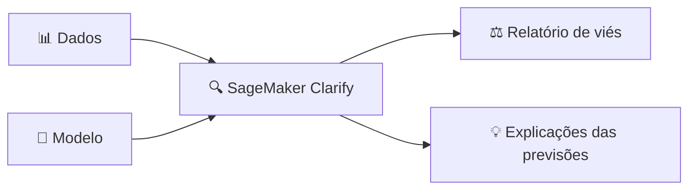

# Módulo 11 · Transparência, explicabilidade e ferramentas da AWS

> **Domínio:** 4 · IA Responsável · **Tempo estimado:** 2h30 · **Pré-requisitos:** Módulo 10

## 🎯 Objetivos de aprendizagem

Ao final deste módulo, você será capaz de:

- Diferenciar **transparência** e **explicabilidade**.
- Conhecer as ferramentas de IA responsável da AWS: **SageMaker Clarify**, **Guardrails**, **AI Service Cards** e **Model Cards**.
- Entender o papel da **supervisão humana**.

 

---

 

## 🧠 Conteúdo

 

### 1. Transparência e explicabilidade

Dois conceitos irmãos, com uma diferença sutil:

| Conceito | Pergunta que responde | Exemplo |
|:--|:--|:--|
| 🔍 **Transparência** | "Como esse sistema foi construído e com quais limitações?" | Documentar dados usados, casos de uso previstos, riscos. |
| 💡 **Explicabilidade** | "**Por que** o modelo tomou **esta** decisão?" | Mostrar quais fatores pesaram na negação de um crédito. |

> [!TIP]
> **Analogia do restaurante** 🍽️
> **Transparência** é publicar o cardápio, os ingredientes e a origem dos alimentos. **Explicabilidade** é o chef explicar por que **este prato específico** ficou salgado. Uma é sobre o sistema como um todo; a outra, sobre cada decisão.

> [!IMPORTANT]
> Modelos de deep learning são frequentemente chamados de **"caixa-preta"** (black box): funcionam bem, mas é difícil explicar cada decisão. Em áreas sensíveis (crédito, saúde, justiça), a explicabilidade pode ser **exigência legal** — às vezes vale usar um modelo mais simples e explicável em vez do mais potente.

 

### 2. SageMaker Clarify — o detector de viés

O **Amazon SageMaker Clarify** ajuda a detectar **viés** nos dados e nos modelos (antes e depois do treino) e a **explicar** as previsões, mostrando quais características mais influenciaram cada resultado.

 

### 3. Guardrails for Amazon Bedrock — o cinto de segurança

Os **Guardrails** permitem definir **regras de segurança** para aplicações de IA generativa: bloquear temas proibidos, filtrar conteúdo tóxico, remover informações pessoais (PII) das respostas e reduzir alucinações.

> [!NOTE]
> Pense nos Guardrails como o **cinto de segurança e os airbags** da sua aplicação de IA: o modelo continua potente, mas com limites que protegem usuários e a empresa.

 

### 4. Documentação responsável: Service Cards e Model Cards

| Recurso | O que é |
|:--|:--|
| 📇 **AWS AI Service Cards** | Documentos da AWS explicando casos de uso previstos, limitações e boas práticas de cada serviço de IA. |
| 🗂️ **SageMaker Model Cards** | "Fichas" que **você** cria documentando seus próprios modelos: para que servem, como foram treinados, limitações. |

> [!TIP]
> Macete: **Service Cards** = a AWS documentando os serviços **dela**. **Model Cards** = você documentando os **seus** modelos. Ambos promovem **transparência**.

 

### 5. Supervisão humana (human-in-the-loop)

Nem tudo deve ser 100% automático. Em decisões críticas, mantenha um **humano no circuito** para revisar e aprovar. O serviço **Amazon A2I (Augmented AI)** facilita inserir revisão humana em fluxos de ML.

> [!IMPORTANT]
> IA responsável na prática = dados de qualidade + testes de viés (Clarify) + limites (Guardrails) + documentação (Cards) + **supervisão humana** onde importa.

 

---

 

## ❓ Quiz — teste seus conhecimentos

 

**1. Qual a diferença entre transparência e explicabilidade?**

- **A)** São sinônimos.
- **B)** Transparência é sobre como o sistema foi construído; explicabilidade é sobre o porquê de cada decisão.
- **C)** Explicabilidade é sobre custo; transparência é sobre velocidade.
- **D)** Nenhuma das anteriores.

💡 Ver resposta

> ✅ **Resposta: B)** — **Transparência** = documentar o sistema e suas limitações. **Explicabilidade** = justificar **cada decisão** do modelo.

 

**2. Qual ferramenta da AWS detecta viés e explica previsões de modelos?**

- **A)** Amazon Rekognition.
- **B)** SageMaker Clarify.
- **C)** AWS Budgets.
- **D)** Amazon Polly.

💡 Ver resposta

> ✅ **Resposta: B)** — O **SageMaker Clarify** detecta **viés** em dados/modelos e gera **explicações** das previsões.

 

**3. Para bloquear temas proibidos e filtrar conteúdo tóxico numa aplicação com Bedrock, você usa...**

- **A)** Guardrails for Amazon Bedrock.
- **B)** Amazon Translate.
- **C)** AWS CloudTrail.
- **D)** Amazon EFS.

💡 Ver resposta

> ✅ **Resposta: A)** — Os **Guardrails** aplicam filtros e limites de segurança às respostas da IA generativa.

 

**4. O que são os SageMaker Model Cards?**

- **A)** Cartões de crédito da AWS.
- **B)** Fichas que você cria para documentar seus próprios modelos (uso, treino, limitações).
- **C)** Tipos de instância EC2.
- **D)** Certificados de conformidade.

💡 Ver resposta

> ✅ **Resposta: B)** — **Model Cards** documentam **seus** modelos, promovendo transparência. (Os **Service Cards** documentam os serviços da AWS.)

 

**5. O que significa "human-in-the-loop"?**

- **A)** Substituir humanos por IA em tudo.
- **B)** Manter revisão humana em decisões críticas do fluxo de IA.
- **C)** Um tipo de rede neural.
- **D)** Um modelo de compra do EC2.

💡 Ver resposta

> ✅ **Resposta: B)** — **Human-in-the-loop** = manter um humano revisando/aprovando decisões críticas. O **Amazon A2I** facilita isso.

 

---

 

## 🧪 Mão na massa (sem console!)

- 🔗 **AWS Skill Builder** → procure por *"SageMaker Clarify"* e *"Guardrails for Amazon Bedrock"*.
- 🔗 Leia um **AI Service Card** oficial (ex.: do Rekognition) e identifique: casos de uso previstos e limitações declaradas.

 

---

 

## 📔 Glossário

| Termo | Significado |
|:--|:--|
| **Transparência** | Documentar como o sistema foi construído e suas limitações. |
| **Explicabilidade** | Justificar por que o modelo tomou cada decisão. |
| **Caixa-preta (black box)** | Modelo difícil de explicar. |
| **SageMaker Clarify** | Detecta viés e explica previsões. |
| **Guardrails** | Filtros e limites de segurança no Bedrock. |
| **AI Service Cards / Model Cards** | Documentação responsável (da AWS / sua). |
| **Human-in-the-loop / A2I** | Revisão humana em decisões críticas. |

 

## ✅ Checklist de conclusão

- [ ] Li todo o conteúdo do módulo
- [ ] Diferencio transparência e explicabilidade
- [ ] Sei o papel do SageMaker Clarify
- [ ] Entendo os Guardrails do Bedrock
- [ ] Diferencio Service Cards e Model Cards
- [ ] Entendo human-in-the-loop
- [ ] Fiz o quiz
- [ ] Registrei meu [Checkpoint](https://github.com/melissaalves-stack/awscloudfoundations/issues/new?template=checkpoint-de-modulo.yml)

 

---

**Precisa de ajuda?** 📊 [Checkpoint](https://github.com/melissaalves-stack/awscloudfoundations/issues/new?template=checkpoint-de-modulo.yml) · ❓ [Dúvida](https://github.com/melissaalves-stack/awscloudfoundations/issues/new?template=duvida.yml) · 📖 [Guia](../../GUIA-DO-ALUNO.md) · 🚀 [Builder Center](https://bit.ly/4w720IR)

⬅️ [Módulo 10](./10-vies-justica-e-riscos.md) &nbsp;·&nbsp; 🏠 [Índice do Domínio 4](./README.md) &nbsp;·&nbsp; ➡️ [Domínio 5 · Segurança e Governança](../dominio-5-seguranca-e-governanca/README.md)

