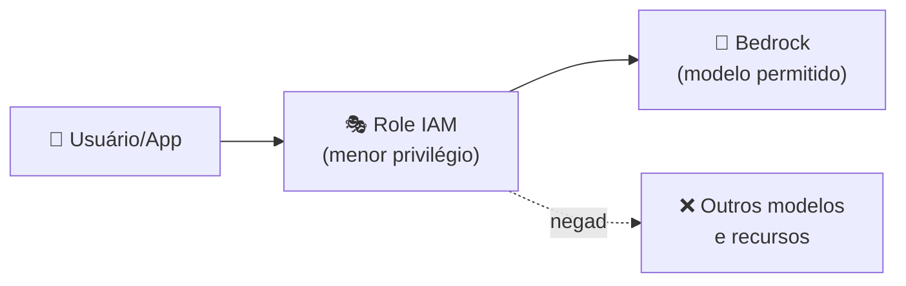

# Módulo 12 · Protegendo soluções de IA na AWS

> **Domínio:** 5 · Segurança e Governança · **Tempo estimado:** 2h30 · **Pré-requisitos:** Domínios 1 a 4

## 🎯 Objetivos de aprendizagem

Ao final deste módulo, você será capaz de:

- Aplicar **IAM e menor privilégio** a soluções de IA.
- Entender **criptografia e privacidade de dados** em IA.
- Reconhecer ameaças específicas, como **prompt injection** e **envenenamento de dados**.

 

---

 

## 🧠 Conteúdo

 

### 1. A base continua a mesma: responsabilidade compartilhada

Tudo que você aprendeu de segurança na nuvem vale para IA. A AWS protege a infraestrutura dos serviços de IA; **você** protege seus dados, prompts, modelos customizados e o acesso a eles.

> [!IMPORTANT]
> Nos serviços de IA da AWS (como o Bedrock), **seus dados não são usados para treinar os modelos de fundação** dos provedores, e seus prompts e respostas ficam na sua conta. Ainda assim, o controle de **quem acessa o quê** é seu — via IAM.

 

### 2. IAM aplicado à IA

O controle de acesso de soluções de IA usa o mesmo **IAM** de sempre:

- 👤 **Menor privilégio**: quem só usa o chatbot não precisa de permissão para treinar modelos.
- 🎭 **Roles** para aplicações: sua aplicação assume uma role para chamar o Bedrock — nunca chaves fixas no código.
- 📜 **Políticas específicas**: é possível permitir acesso a **modelos específicos** e negar o resto.

 

### 3. Protegendo os dados da IA

| Camada | Como proteger |
|:--|:--|
| 🛑 **Dados em repouso** | Criptografia com **KMS** (datasets, embeddings, modelos customizados). |
| 🚚 **Dados em trânsito** | HTTPS/TLS em todas as chamadas. |
| 🕵️ **Dados sensíveis (PII)** | Detectar e mascarar com **Macie** (no S3) e filtros de **Guardrails**. |
| 🗝️ **Segredos** | Chaves de API no **Secrets Manager**, nunca no código. |
| 🔒 **Isolamento de rede** | Acessar serviços por **VPC endpoints**, sem passar pela internet pública. |

> [!TIP]
> Os dados que alimentam RAG e fine-tuning são um **tesouro** — e um alvo. Trate datasets e bases de conhecimento com o mesmo rigor de qualquer dado sensível: criptografia, acesso mínimo e auditoria.

 

### 4. Ameaças específicas de IA

| Ameaça | O que é |
|:--|:--|
| 💉 **Prompt injection** | Instruções maliciosas escondidas no input para sequestrar o modelo ([lembra do Módulo 05](../dominio-2-fundamentos-de-ia-generativa/05-engenharia-de-prompt.md)?). |
| ☠️ **Envenenamento de dados (data poisoning)** | Contaminar os dados de treino para corromper o comportamento do modelo. |
| 🎭 **Vazamento de dados** | O modelo revelar informações sensíveis vistas no treino ou no contexto. |
| 🔓 **Jailbreak** | Tentativas de burlar as regras de segurança do modelo. |

> [!WARNING]
> Mitigações principais: **validar e sanear entradas**, aplicar **Guardrails**, controlar as **fontes de dados** de treino/RAG e manter **supervisão humana** em fluxos críticos.

 

---

 

## ❓ Quiz — teste seus conhecimentos

 

**1. No Bedrock, seus prompts e dados são usados para treinar os modelos de fundação dos provedores?**

- **A)** Sim, sempre.
- **B)** Não — seus dados não treinam os modelos dos provedores e ficam na sua conta.
- **C)** Apenas aos fins de semana.
- **D)** Somente se você usar o Free Tier.

💡 Ver resposta

> ✅ **Resposta: B)** — Seus dados **não** são usados para treinar os modelos de fundação; permanecem sob seu controle na sua conta.

 

**2. Sua aplicação precisa chamar o Bedrock. Qual a forma segura de dar esse acesso?**

- **A)** Colocar chaves de acesso fixas no código.
- **B)** Usar uma role do IAM com menor privilégio.
- **C)** Usar o usuário root.
- **D)** Deixar o acesso público.

💡 Ver resposta

> ✅ **Resposta: B)** — Aplicações devem assumir **roles** com **menor privilégio** — nunca chaves fixas no código.

 

**3. Como proteger os datasets usados em RAG e fine-tuning quando armazenados?**

- **A)** Deixá-los públicos para facilitar.
- **B)** Criptografia em repouso com KMS e acesso mínimo via IAM.
- **C)** Imprimir e guardar em papel.
- **D)** Não é preciso proteger.

💡 Ver resposta

> ✅ **Resposta: B)** — Datasets são dados sensíveis: **criptografia (KMS)** + **menor privilégio** + auditoria.

 

**4. Contaminar os dados de treino para corromper o modelo é qual ataque?**

- **A)** Prompt injection.
- **B)** Envenenamento de dados (data poisoning).
- **C)** DDoS.
- **D)** Phishing.

💡 Ver resposta

> ✅ **Resposta: B)** — **Data poisoning** ataca a **fonte**: os dados de treino. Por isso controlar a origem dos dados é vital.

 

**5. Qual recurso ajuda a filtrar PII e conteúdo tóxico nas respostas de uma aplicação com Bedrock?**

- **A)** Guardrails.
- **B)** Amazon Redshift.
- **C)** AWS Budgets.
- **D)** Amazon EFS.

💡 Ver resposta

> ✅ **Resposta: A)** — Os **Guardrails** filtram PII, temas proibidos e toxicidade nas respostas.

 

---

 

## 🧪 Mão na massa (sem console!)

- 🔗 **AWS Skill Builder** → procure por *"Security in Amazon Bedrock"* e *"AI Security"*.
- 🔗 Desenhe as camadas de proteção de um chatbot da Liga: IAM (quem acessa), KMS (dados), Guardrails (respostas), Secrets Manager (chaves).

 

---

 

## 📔 Glossário

| Termo | Significado |
|:--|:--|
| **Menor privilégio** | Só as permissões estritamente necessárias. |
| **Role** | Identidade assumível para aplicações (sem chaves fixas). |
| **KMS** | Gerenciamento de chaves de criptografia. |
| **PII** | Informações pessoais identificáveis. |
| **VPC endpoint** | Acesso a serviços sem passar pela internet pública. |
| **Prompt injection / Data poisoning / Jailbreak** | Ameaças específicas de IA. |

 

## ✅ Checklist de conclusão

- [ ] Li todo o conteúdo do módulo
- [ ] Sei aplicar IAM e menor privilégio à IA
- [ ] Entendo a proteção dos dados (repouso, trânsito, PII, segredos)
- [ ] Reconheço prompt injection, data poisoning e jailbreak
- [ ] Sei que meus dados não treinam os modelos dos provedores
- [ ] Fiz o quiz
- [ ] Registrei meu [Checkpoint](https://github.com/melissaalves-stack/awscloudfoundations/issues/new?template=checkpoint-de-modulo.yml)

 

---

**Precisa de ajuda?** 📊 [Checkpoint](https://github.com/melissaalves-stack/awscloudfoundations/issues/new?template=checkpoint-de-modulo.yml) · ❓ [Dúvida](https://github.com/melissaalves-stack/awscloudfoundations/issues/new?template=duvida.yml) · 📖 [Guia](../../GUIA-DO-ALUNO.md) · 🚀 [Builder Center](https://bit.ly/4w720IR)

🏠 [Índice do Domínio 5](./README.md) &nbsp;·&nbsp; ➡️ [Módulo 13 · Governança e conformidade](./13-governanca-e-conformidade.md)

