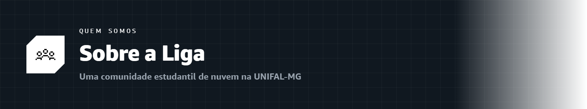

  

# 💜 Sobre a Liga

### Liga Acadêmica de Computação em Nuvem · SBG · UNIFAL-MG
Alfenas · Minas Gerais · Brasil

---

## 🌩️ Quem somos

A **Liga Acadêmica de Computação em Nuvem** da **Universidade Federal de Alfenas (UNIFAL-MG)** é uma comunidade estudantil vinculada ao programa **AWS Student Builder Group (SBG)**. Nascemos com uma missão simples e ambiciosa: **democratizar o acesso ao conhecimento em computação em nuvem e inteligência artificial**, formando uma nova geração de construtores.

Aqui, ninguém precisa de dinheiro, cartão de crédito ou experiência prévia para começar. Precisa só de **vontade de aprender construindo**.

> [!NOTE]
> Nosso lema resume tudo: **"Aprenda construindo, não decorando."** Todo o aprendizado acontece de forma prática, gratuita e 100% dentro do GitHub.

---

## 🎯 Nossa missão

- 🌱 **Formar do zero** — levar qualquer estudante do "nunca ouvi falar em nuvem" até certificações oficiais da AWS.
- 🤝 **Construir comunidade** — criar uma rede de apoio onde todo mundo aprende e ensina.
- 🚀 **Abrir portas** — conectar estudantes a oportunidades reais de carreira em tecnologia.
- 💡 **Compartilhar conhecimento** — de graça, para sempre, para todos.

---

## 👑 Nossa fundadora e presidente

<table>
<tr>
<td width="35%" valign="top" align="center">

 

**Melissa Hollanda de Oliveira Alves**

</td>
<td width="65%" valign="top">

Estudante de **Ciência da Computação** na **Universidade Federal de Alfenas (UNIFAL-MG)**, Melissa é a **fundadora e presidente** da Liga Acadêmica de Computação em Nuvem.

Como **AWS Student Builder Group Leader**, ela lidera a comunidade, produz o conteúdo educacional das trilhas e conduz a capacitação dos membros. Também atua como **Google Student Ambassador 2026**, construindo pontes entre estudantes e as maiores plataformas de tecnologia do mundo.

Toda a trilha que você encontra neste repositório — incluindo o **conteúdo aprofundado da capacitação oficial de líderes** — foi construída e disponibilizada por ela, para que ninguém precise começar do zero sozinho.

**Cargos e títulos:**
- 👑 Fundadora e Presidente · Liga Acadêmica de Computação em Nuvem (UNIFAL-MG)
- ☁️ AWS Student Builder Group Leader
- 🎓 Google Student Ambassador 2026
- 💻 Graduanda em Ciência da Computação · UNIFAL-MG

**Onde encontrar:**

</td>
</tr>
</table>

---

## 🧭 Por que uma liga liderada por estudantes?

Porque quem estuda entende quem está estudando. A liderança da Liga passa pela **capacitação oficial da AWS** — a mesma formação que os líderes do programa recebem gratuitamente e **precisam concluir** para permanecer vinculados. Isso garante que quem ensina realmente **domina** o conteúdo.

É por isso que a trilha de **[Aprendizado Aprofundado](../aprofundamento/)** existe: ela abre para toda a comunidade o mesmo conhecimento técnico que forma os líderes. 💪

---

## 🤝 Faça parte

> [!IMPORTANT]
> Quer entrar para a Liga? Crie seu perfil no **AWS Builder Center** pelo link oficial:
>
> ### 👉 [Entrar no AWS Builder Center](https://bit.ly/4w720IR)

Depois, siga o **[📖 Guia do Aluno](../GUIA-DO-ALUNO.md)** e comece por qualquer uma das três trilhas.

---

### 🌐 [Site oficial](https://awsbuildersunifal.vercel.app) &nbsp;·&nbsp; 📸 [Instagram](https://www.instagram.com/awsbuilders.unifal) &nbsp;·&nbsp; 📅 [Meetup](https://www.meetup.com/aws-sbg-at-federal-university-of-alfenas)

**Liga Acadêmica SBG · UNIFAL-MG**
Feito com 🧡 pela comunidade · Bora construir! 🚀

 

🏠 [Voltar ao início](../README.md)

