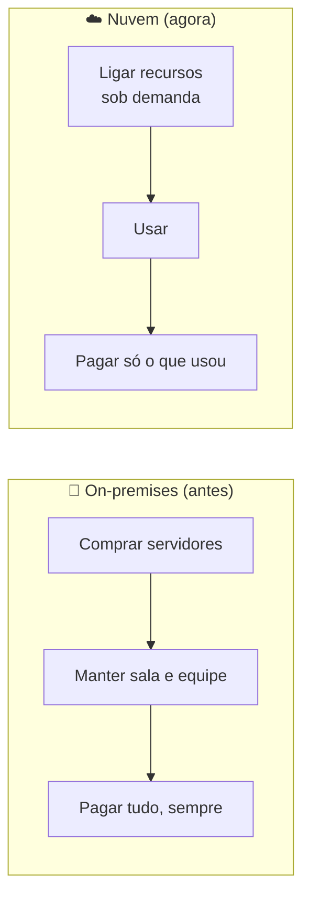

# Módulo 00 · Por que a nuvem existe

> **Nível:** 1 · Fundamentos de Nuvem · **Tempo estimado:** 3h · **Pré-requisitos:** nenhum

## 🎯 Objetivos de aprendizagem
Ao final deste módulo, você será capaz de:
- [ ] Explicar o problema que existia **antes** da computação em nuvem.
- [ ] Definir o que é computação em nuvem com suas próprias palavras.
- [ ] Diferenciar os modelos de serviço (IaaS, PaaS, SaaS).
- [ ] Reconhecer as principais vantagens da nuvem.

---

## 🧠 Conteúdo

### 1. O mundo antes da nuvem

Imagine que você teve uma ideia genial de aplicativo. Nos anos 2000, para colocá-lo no ar, você precisaria:

1. **Comprar servidores físicos** (computadores caros, de milhares de reais cada).
2. Alugar uma **sala refrigerada** para guardá-los.
3. Contratar gente para **manter tudo funcionando** 24 horas por dia.
4. **Adivinhar** quantos usuários teria — e torcer para acertar.

> [!WARNING]
> O maior problema era o **chute**. Se você comprasse poucos servidores e o app viralizasse, ele **caía**. Se comprasse muitos e ninguém aparecesse, você **perdia dinheiro** com máquinas paradas.

Esse modelo é o que chamamos de **on-premises** (ou "on-prem"): tudo por sua conta, na sua infraestrutura.

### 2. A grande virada: a nuvem

**Computação em nuvem é alugar recursos de tecnologia (servidores, armazenamento, banco de dados) pela internet, pagando apenas pelo que você usar** — em vez de comprar e manter tudo isso você mesmo.

> [!TIP]
> **Analogia da energia elétrica** ⚡
> Você não tem uma usina em casa para ter luz. Você liga o interruptor, usa a energia e paga só o que consumiu no fim do mês. A nuvem é a mesma coisa, só que para computação: você "liga" um servidor quando precisa e paga pelo uso.

### 3. Os modelos de serviço: IaaS, PaaS e SaaS

Nem toda nuvem entrega a mesma coisa. Existem três "níveis de prontidão":

| Modelo | O que é | Analogia da pizza 🍕 | Exemplo |
|:--|:--|:--|:--|
| **IaaS** (Infraestrutura como Serviço) | Você aluga a infraestrutura crua (servidores, rede) e monta o resto. | Massa e ingredientes: você faz a pizza. | Amazon EC2 |
| **PaaS** (Plataforma como Serviço) | A plataforma já vem pronta; você só coloca seu código. | Pizza pré-assada: você só esquenta. | AWS Elastic Beanstalk |
| **SaaS** (Software como Serviço) | O software pronto, é só usar. | Pizza entregue na sua porta. | Gmail, Dropbox |

> [!NOTE]
> Quanto mais você sobe de IaaS → PaaS → SaaS, **menos** você gerencia e **mais** a AWS gerencia por você. Você troca controle por conveniência.

### 4. Por que todo mundo migrou? As vantagens

- 💰 **Custo variável:** troque grandes gastos iniciais por pagamento sob demanda.
- 📈 **Elasticidade:** cresça e diminua os recursos automaticamente conforme a demanda.
- ⚡ **Agilidade:** suba um servidor em minutos, não em semanas.
- 🌍 **Alcance global:** entregue seu app no mundo todo com poucos cliques.
- 🔧 **Menos manutenção:** a AWS cuida do hardware, refrigeração e energia por você.

> [!TIP]
> É por isso que empresas como Netflix, Spotify e Nubank rodam na nuvem: elas precisam aguentar picos gigantes de acesso **sem** comprar data centers próprios.

---

## 🧪 Mão na massa (sem console!)

Você **não precisa** de conta pessoal nem cartão de crédito. Pratique em ambiente pronto:

- 🔗 **AWS Skill Builder** → curso *"AWS Cloud Practitioner Essentials"* (comece pela introdução).
- 🔗 **AWS SimuLearn** → módulos introdutórios de nuvem com prática guiada por IA.

> [!IMPORTANT]
> Ainda não entrou na comunidade? Crie seu perfil pelo **[link da Liga no AWS Builder Center](../../GUIA-DO-ALUNO.md)** antes de começar os labs.

---

## ❓ Quiz

<b>1. Qual era o maior risco do modelo on-premises?</b>

Ter que **adivinhar** a demanda: comprar servidores demais (desperdício de dinheiro) ou de menos (o sistema caía nos picos de acesso).

<b>2. Explique a nuvem usando a analogia da energia elétrica.</b>

Assim como você usa energia da tomada e paga só o que consome (sem ter uma usina em casa), na nuvem você usa servidores sob demanda e paga só pelo uso — sem comprar hardware.

<b>3. No modelo SaaS, quem gerencia o software?</b>

O **provedor** (a AWS ou a empresa dona do software). Você apenas usa o produto pronto, como no Gmail. É o modelo com **menos** gerenciamento da sua parte.

<b>4. O que significa "elasticidade"?</b>

A capacidade de **aumentar ou diminuir** recursos automaticamente conforme a demanda sobe ou desce — pagando apenas pelo que estiver em uso.

---

## 📔 Glossário
| Termo | Significado |
|:--|:--|
| **On-premises** | Infraestrutura própria, mantida pela empresa em suas instalações. |
| **IaaS / PaaS / SaaS** | Modelos de serviço em nuvem, do mais "cru" ao mais "pronto". |
| **Elasticidade** | Ajuste automático de recursos conforme a demanda. |
| **Sob demanda** | Recurso ligado quando necessário e pago apenas pelo uso. |

## ✅ Checklist de conclusão
- [ ] Li todo o conteúdo do módulo
- [ ] Entendi a diferença entre on-premises e nuvem
- [ ] Consigo explicar IaaS, PaaS e SaaS
- [ ] Fiz o quiz
- [ ] Explorei um lab no Skill Builder ou SimuLearn

---
🏠 [Índice do Nível 1](./README.md) · ➡️ [Módulo 01 · A infraestrutura global da AWS](./01-infraestrutura-global-da-aws.md)
