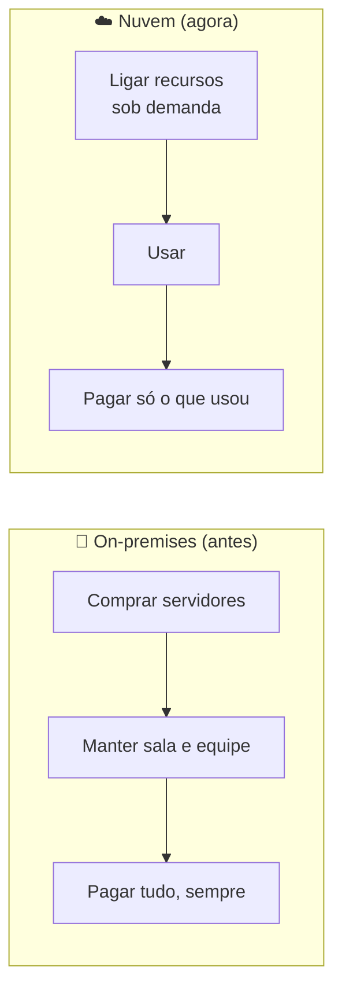

# Módulo 00 · Por que a nuvem existe

> **Nível:** 1 · Fundamentos de Nuvem · **Tempo estimado:** 3h · **Pré-requisitos:** nenhum

> [!NOTE]
> 📅 **No cronograma da Liga:** este módulo é a base do **Evento 1 · A Origem** (Agosto/2026), que abre o ciclo com os fundamentos de nuvem. Domínio da prova: **CLF-C02 D1 · Cloud Concepts (24%)**.

## 🎯 Objetivos de aprendizagem
Ao final deste módulo, você será capaz de:
- [ ] Explicar o problema que existia **antes** da computação em nuvem.
- [ ] Definir o que é computação em nuvem com suas próprias palavras.
- [ ] Diferenciar os modelos de serviço (IaaS, PaaS, SaaS) e de implantação (nuvem, on-premises, híbrida).
- [ ] Reconhecer as 6 vantagens da nuvem cobradas na prova.

---

## 🧠 Conteúdo

### 1. O mundo antes da nuvem

Imagine que você teve uma ideia genial de aplicativo. Nos anos 2000, para colocá-lo no ar, você precisaria:

1. **Comprar servidores físicos** (computadores caros, de milhares de reais cada).
2. Alugar uma **sala refrigerada** para guardá-los.
3. Contratar gente para **manter tudo funcionando** 24 horas por dia.
4. **Adivinhar** quantos usuários teria — e torcer para acertar.

> [!WARNING]
> O maior problema era o **chute**. Se você comprasse poucos servidores e o app viralizasse, ele **caía**. Se comprasse muitos e ninguém aparecesse, você **perdia dinheiro** com máquinas paradas. As duas pontas eram ruins.

Esse modelo é o que chamamos de **on-premises** (ou "on-prem"): tudo por sua conta, na sua infraestrutura.

### 2. A grande virada: a nuvem

**Computação em nuvem é alugar recursos de tecnologia (servidores, armazenamento, banco de dados) pela internet, pagando apenas pelo que você usar** — em vez de comprar e manter tudo isso você mesmo.

> [!TIP]
> **Analogia da energia elétrica** ⚡
> Você não tem uma usina em casa para ter luz. Você liga o interruptor, usa a energia e paga só o que consumiu no fim do mês. A nuvem é a mesma coisa, só que para computação: você "liga" um servidor quando precisa e paga pelo uso.

### 3. Os modelos de serviço: IaaS, PaaS e SaaS

Nem toda nuvem entrega a mesma coisa. Existem três "níveis de prontidão":

| Modelo | O que é | Analogia da pizza 🍕 | Exemplo |
|:--|:--|:--|:--|
| **IaaS** (Infraestrutura como Serviço) | Você aluga a infraestrutura crua (servidores, rede) e monta o resto. | Massa e ingredientes: você faz a pizza. | Amazon EC2 |
| **PaaS** (Plataforma como Serviço) | A plataforma já vem pronta; você só coloca seu código. | Pizza pré-assada: você só esquenta. | AWS Elastic Beanstalk |
| **SaaS** (Software como Serviço) | O software pronto, é só usar. | Pizza entregue na sua porta. | Gmail, Dropbox |

> [!NOTE]
> Quanto mais você sobe de IaaS → PaaS → SaaS, **menos** você gerencia e **mais** a AWS gerencia por você. Você troca controle por conveniência. Não existe modelo "melhor": existe o certo para cada caso.

### 4. Os modelos de implantação (deployment)

Onde os recursos rodam também é uma escolha. A prova cobra três modelos:

| Modelo | O que é | Quando usar |
|:--|:--|:--|
| ☁️ **Nuvem (cloud)** | Tudo roda na nuvem de um provedor como a AWS. | Novos projetos, startups, quem quer agilidade. |
| 🏢 **On-premises** | Tudo roda na sua própria infraestrutura. | Exigências legais, latência muito baixa, hardware específico. |
| 🔗 **Híbrido (hybrid)** | Parte na nuvem, parte on-premises, conectadas. | Migração gradual, dados sensíveis locais + processamento na nuvem. |

> [!TIP]
> Muita empresa grande começa **híbrida**: mantém sistemas antigos on-premises e cria os novos na nuvem, migrando aos poucos. É o caminho mais comum do mundo real.

### 5. Por que todo mundo migrou? As 6 vantagens

A AWS resume o valor da nuvem em **6 vantagens** — e a prova gosta de cobrá-las:

- 💰 **Troque despesa de capital por despesa variável:** em vez de um grande gasto inicial (CapEx), você paga sob demanda (OpEx).
- 📉 **Ganhe com economias de escala:** como milhões de clientes usam a AWS, o preço por unidade cai — e você aproveita.
- 🎯 **Pare de adivinhar capacidade:** suba e desça recursos conforme a demanda real, sem chute.
- ⚡ **Ganhe velocidade e agilidade:** suba um servidor em minutos, não em semanas.
- 🔧 **Pare de gastar com data centers:** a AWS cuida de hardware, refrigeração e energia por você.
- 🌍 **Fique global em minutos:** entregue seu app no mundo todo com poucos cliques.

> [!IMPORTANT]
> Guarde a diferença entre **CapEx** (gasto de capital, comprar o ativo de uma vez) e **OpEx** (gasto operacional, pagar pelo uso). Trocar CapEx por OpEx é **a** ideia econômica central da nuvem.

> [!TIP]
> É por isso que empresas como Netflix, Spotify e Nubank rodam na nuvem: elas precisam aguentar picos gigantes de acesso **sem** comprar data centers próprios.

---

## 🧪 Mão na massa (sem console!)

Você **não precisa** de conta pessoal nem cartão de crédito. Pratique em ambiente pronto:

- 🔗 **AWS Skill Builder** → curso *"AWS Cloud Practitioner Essentials"* (comece pela introdução).
- 🔗 **AWS SimuLearn** → módulos introdutórios de nuvem com prática guiada por IA.

> [!IMPORTANT]
> Ainda não entrou na comunidade? Crie seu perfil pelo **[link da Liga no AWS Builder Center](../../GUIA-DO-ALUNO.md)** antes de começar os labs.

> [!TIP]
> **Para a liderança:** este módulo casa com o hands-on de abertura do **Evento 1** — o primeiro contato com o Console AWS e o Free Tier. Reforce a analogia da energia elétrica no Kahoot do mês.

---

## ❓ Quiz

<b>1. Qual era o maior risco do modelo on-premises?</b>

Ter que **adivinhar** a demanda: comprar servidores demais (desperdício de dinheiro) ou de menos (o sistema caía nos picos de acesso). A nuvem resolve isso deixando você ajustar a capacidade sob demanda.

<b>2. Explique a nuvem usando a analogia da energia elétrica.</b>

Assim como você usa energia da tomada e paga só o que consome (sem ter uma usina em casa), na nuvem você usa servidores sob demanda e paga só pelo uso — sem comprar hardware.

<b>3. No modelo SaaS, quem gerencia o software?</b>

O **provedor** (a AWS ou a empresa dona do software). Você apenas usa o produto pronto, como no Gmail. É o modelo com **menos** gerenciamento da sua parte.

<b>4. O que significa trocar "CapEx por OpEx"?</b>

Trocar um grande **gasto de capital** inicial (comprar servidores) por um **gasto operacional** variável (pagar pelo uso, mês a mês). É a lógica econômica central da nuvem.

<b>5. Uma empresa mantém seus sistemas antigos no próprio data center, mas cria os novos na AWS, conectando os dois. Que modelo de implantação é esse?</b>

**Híbrido (hybrid)** — parte on-premises, parte na nuvem, integradas. É o caminho típico de quem está migrando aos poucos.

---

## 📔 Glossário
| Termo | Significado |
|:--|:--|
| **On-premises** | Infraestrutura própria, mantida pela empresa em suas instalações. |
| **IaaS / PaaS / SaaS** | Modelos de serviço em nuvem, do mais "cru" ao mais "pronto". |
| **Nuvem / Híbrido / On-premises** | Modelos de implantação: onde os recursos rodam. |
| **CapEx** | Despesa de capital: investimento inicial em um ativo. |
| **OpEx** | Despesa operacional: pagamento recorrente pelo uso. |
| **Elasticidade** | Ajuste automático de recursos conforme a demanda. |
| **Sob demanda** | Recurso ligado quando necessário e pago apenas pelo uso. |

## ✅ Checklist de conclusão
- [ ] Li todo o conteúdo do módulo
- [ ] Entendi a diferença entre on-premises e nuvem
- [ ] Consigo explicar IaaS, PaaS e SaaS
- [ ] Sei diferenciar os modelos de implantação (nuvem, híbrido, on-premises)
- [ ] Decorei as 6 vantagens e a troca CapEx→OpEx
- [ ] Fiz o quiz
- [ ] Explorei um lab no Skill Builder ou SimuLearn

---
🏠 [Índice do Nível 1](./README.md) · ➡️ [Módulo 01 · A infraestrutura global da AWS](./01-infraestrutura-global-da-aws.md)
