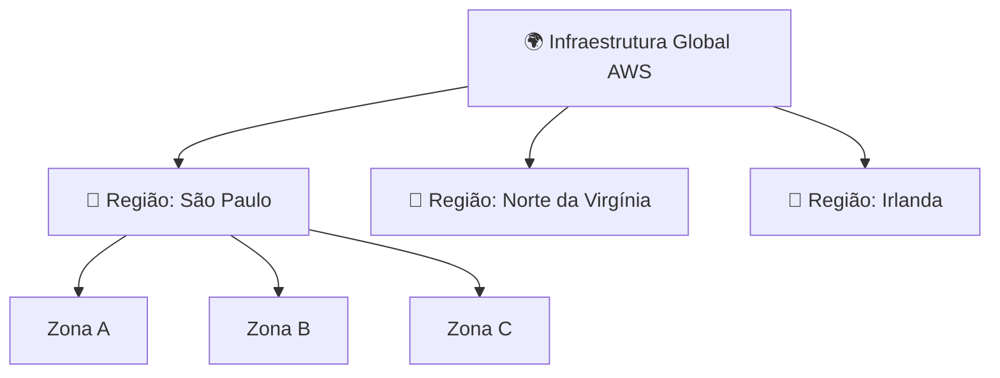
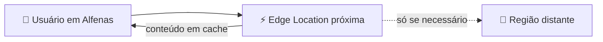

# Módulo 01 · A infraestrutura global da AWS

> **Nível:** 1 · Fundamentos de Nuvem · **Tempo estimado:** 3h · **Pré-requisitos:** Módulo 00

## 🎯 Objetivos de aprendizagem
Ao final deste módulo, você será capaz de:
- [ ] Explicar o que são Regiões e Zonas de Disponibilidade (AZs).
- [ ] Entender por que a AWS espalha data centers pelo mundo.
- [ ] Escolher uma Região com base em critérios reais.
- [ ] Reconhecer o papel das Edge Locations na entrega de conteúdo.

---

## 🧠 Conteúdo

### 1. A nuvem é feita de prédios reais

"Nuvem" parece algo mágico e abstrato, mas ela é **muito física**: são milhares de computadores dentro de **data centers** — galpões gigantes cheios de servidores — espalhados pelo planeta.

> [!NOTE]
> Quando você "sobe algo na nuvem", esse algo está rodando em um prédio real, em algum lugar do mundo. A AWS só cuida de tudo isso por você.

### 2. Regiões (Regions)

Uma **Região** é uma área geográfica do mundo onde a AWS tem infraestrutura. Exemplos: São Paulo (Brasil), Norte da Virgínia (EUA), Irlanda, Tóquio.

### 3. Zonas de Disponibilidade (Availability Zones / AZs)

Cada Região é dividida em várias **Zonas de Disponibilidade**. Uma AZ é composta por **um ou mais data centers** independentes, com energia, refrigeração e rede próprias, e ficam fisicamente **separadas** umas das outras (mas conectadas por links rápidos).

> [!TIP]
> **Por que isso importa?** Se um data center pega fogo, inunda ou fica sem energia, os outros continuam funcionando. Ao distribuir sua aplicação em **múltiplas AZs**, ela continua no ar mesmo se uma zona inteira falhar. Isso se chama **alta disponibilidade**.

> [!WARNING]
> Colocar tudo em uma única AZ é como guardar todos os seus arquivos em um único HD sem backup. Funciona... até o dia em que não funciona.

### 4. Como escolher uma Região?

Não existe Região "melhor" — existe a mais adequada ao seu caso. Considere:

| Critério | Pergunta que você faz |
|:--|:--|
| 🏃 **Latência** | Meus usuários estão perto dessa Região? (mais perto = mais rápido) |
| 💵 **Custo** | Os preços variam entre Regiões. Qual cabe no orçamento? |
| ⚖️ **Conformidade** | A lei exige que os dados fiquem no país? (ex.: LGPD no Brasil) |
| 🧩 **Serviços disponíveis** | A Região tem o serviço específico que eu preciso? |

> [!NOTE]
> Para usuários no Brasil, a Região **São Paulo (sa-east-1)** costuma oferecer a menor latência e ajuda em questões de conformidade com a LGPD.

### 5. Edge Locations e a "borda" da rede

Além das Regiões, a AWS tem centenas de **Edge Locations** — pontos menores, espalhados em ainda mais cidades, usados para **entregar conteúdo mais perto do usuário final**.

É o que faz um vídeo ou site carregar rápido: em vez de buscar o conteúdo do outro lado do mundo, ele é servido de uma borda pertinho de você. O serviço que usa isso é o **Amazon CloudFront** (veremos no Nível 2).

---

## 🧪 Mão na massa (sem console!)

- 🔗 **AWS Skill Builder** → módulo sobre *"AWS Global Infrastructure"* dentro do Cloud Practitioner Essentials.
- 🔗 Explore o mapa interativo da infraestrutura global no site oficial da AWS (apenas visualização, sem login).

---

## ❓ Quiz

<b>1. Qual a diferença entre uma Região e uma Zona de Disponibilidade?</b>

Uma **Região** é uma área geográfica (ex.: São Paulo). Uma **Zona de Disponibilidade (AZ)** é um ou mais data centers isolados **dentro** de uma Região. Cada Região tem várias AZs.

<b>2. Por que distribuir uma aplicação em várias AZs?</b>

Para garantir **alta disponibilidade**: se uma AZ falhar (incêndio, queda de energia), as outras continuam operando e a aplicação não sai do ar.

<b>3. Cite dois critérios para escolher uma Região.</b>

Quaisquer dois entre: **latência** (proximidade dos usuários), **custo**, **conformidade legal** (ex.: LGPD) e **disponibilidade de serviços** naquela Região.

<b>4. Para que servem as Edge Locations?</b>

Para entregar conteúdo (imagens, vídeos, páginas) **mais perto do usuário final**, reduzindo o tempo de carregamento. É a base do Amazon CloudFront.

---

## 📔 Glossário
| Termo | Significado |
|:--|:--|
| **Região (Region)** | Área geográfica com infraestrutura da AWS. |
| **Zona de Disponibilidade (AZ)** | Um ou mais data centers isolados dentro de uma Região. |
| **Alta disponibilidade** | Capacidade de continuar funcionando mesmo com falhas. |
| **Edge Location** | Ponto de presença para entregar conteúdo perto do usuário. |

## ✅ Checklist de conclusão
- [ ] Li todo o conteúdo do módulo
- [ ] Sei diferenciar Região, AZ e Edge Location
- [ ] Entendi por que usar múltiplas AZs
- [ ] Fiz o quiz
- [ ] Explorei o mapa da infraestrutura global

---
⬅️ [Módulo 00](./00-por-que-a-nuvem-existe.md) · 🏠 [Índice do Nível 1](./README.md) · ➡️ [Módulo 02 · Identidade e acesso (IAM)](./02-identidade-e-acesso-iam.md)
