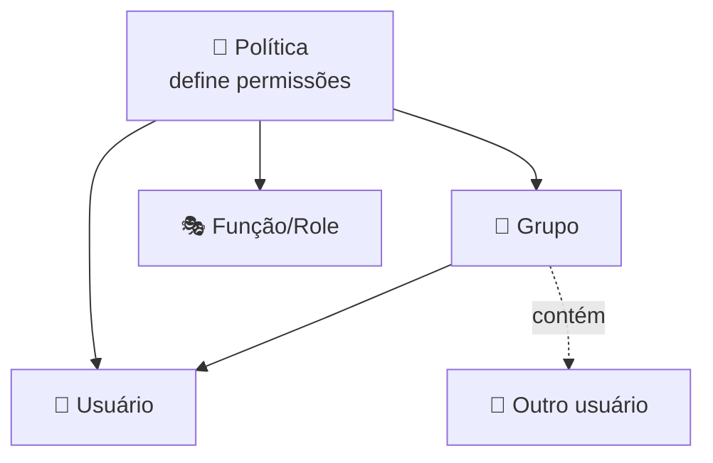
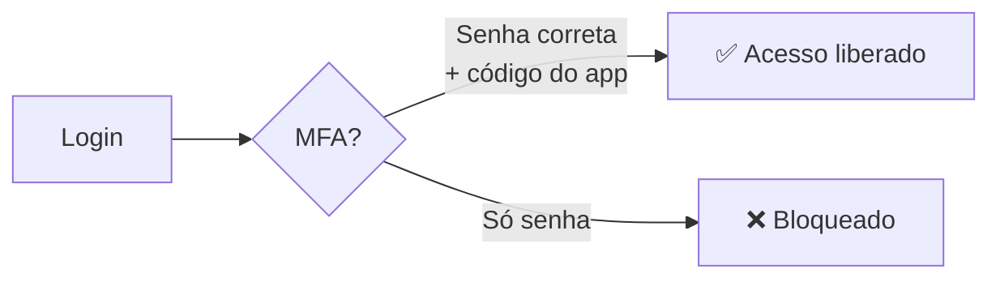

# Módulo 02 · Identidade e acesso (IAM)

> **Nível:** 1 · Fundamentos de Nuvem · **Tempo estimado:** 4h · **Pré-requisitos:** Módulos 00 e 01

## 🎯 Objetivos de aprendizagem
Ao final deste módulo, você será capaz de:
- [ ] Diferenciar autenticação de autorização.
- [ ] Entender o que são usuários, grupos, funções (roles) e políticas (policies) no IAM.
- [ ] Aplicar o princípio do menor privilégio.
- [ ] Listar boas práticas de segurança de acesso.

---

## 🧠 Conteúdo

### 1. Autenticação vs. autorização

Dois conceitos que parecem iguais, mas não são:

- 🔑 **Autenticação** = provar **quem você é**. (Ex.: entrar com login e senha.)
- 🚪 **Autorização** = definir **o que você pode fazer** depois de entrar.

> [!TIP]
> Analogia do prédio: a **autenticação** é o crachá que prova que você trabalha ali. A **autorização** é quais portas o seu crachá abre. Você pode entrar no prédio (autenticado) mas não ter acesso à sala do servidor (não autorizado).

O serviço que cuida disso na AWS é o **IAM — Identity and Access Management** (Gerenciamento de Identidade e Acesso). E o melhor: **o IAM é gratuito**.

### 2. O usuário root: poderoso e perigoso

Quando uma conta AWS é criada, nasce o **usuário root** — o "dono" absoluto, com acesso a **tudo**.

> [!CAUTION]
> O usuário root é como a chave-mestra do prédio. Você **não** deve usá-lo no dia a dia. Configure-o com uma senha forte + MFA, guarde-o em segurança e use-o apenas para tarefas muito específicas. Para o resto, crie usuários IAM.

### 3. Os quatro conceitos do IAM

| Conceito | O que é | Exemplo |
|:--|:--|:--|
| 👤 **Usuário (User)** | Uma identidade para uma pessoa ou aplicação. | A usuária "melissa". |
| 👥 **Grupo (Group)** | Um conjunto de usuários que compartilham permissões. | Grupo "Desenvolvedores". |
| 🎭 **Função (Role)** | Uma identidade "temporária" que pode ser assumida por quem precisa. | Uma role que um servidor assume para ler arquivos. |
| 📜 **Política (Policy)** | Um documento que **define permissões** (o que pode/não pode). | "Pode ler arquivos, mas não apagar." |

> [!NOTE]
> **Grupos** facilitam a vida: em vez de dar permissões um por um, você aplica a política ao grupo e adiciona pessoas nele. **Roles** são ótimas para dar permissões a **serviços** (não a pessoas), sem precisar de senhas.

### 4. O princípio do menor privilégio

Esta é **a regra de ouro da segurança na nuvem**:

> [!IMPORTANT]
> **Dê a cada usuário apenas as permissões mínimas necessárias para fazer o trabalho dele — nada além disso.**

Se a pessoa só precisa **ler** relatórios, ela não deve poder **apagar** o banco de dados. Menos permissões = menos risco se aquela conta for comprometida.

### 5. Boas práticas de segurança

- ✅ Ative **MFA** (autenticação multifator) — uma segunda prova além da senha (ex.: código no celular).
- ✅ **Não use o root** no dia a dia; crie usuários IAM.
- ✅ Aplique o **menor privilégio** sempre.
- ✅ Use **grupos** para organizar permissões.
- ✅ Use **roles** para dar acesso a serviços e aplicações.
- ✅ Nunca compartilhe senhas nem coloque chaves de acesso em código público.

---

## 🧪 Mão na massa (sem console!)

- 🔗 **AWS Skill Builder** → labs guiados de *"Introduction to AWS Identity and Access Management (IAM)"*.
- 🔗 **AWS Builder Labs** → laboratório com ambiente pronto para praticar criação de usuários, grupos e políticas **sem** usar sua própria conta.

> [!TIP]
> Como líder da liga, use os **Builder Labs** nos encontros: os alunos praticam IAM em um ambiente isolado e seguro, sem risco e sem cartão de crédito.

---

## ❓ Quiz

<b>1. Qual a diferença entre autenticação e autorização?</b>

**Autenticação** prova quem você é (login/senha). **Autorização** define o que você pode fazer depois de autenticado.

<b>2. Por que não devemos usar o usuário root no dia a dia?</b>

Porque ele tem acesso irrestrito a tudo. Se for comprometido, o estrago é total. O ideal é protegê-lo com MFA, guardá-lo e usar usuários IAM com permissões limitadas no dia a dia.

<b>3. O que é o princípio do menor privilégio?</b>

Conceder a cada identidade **apenas as permissões mínimas** necessárias para sua função — nada a mais. Reduz o risco em caso de comprometimento.

<b>4. Quando usar uma Role em vez de um Usuário?</b>

Use **Roles** para dar permissões a **serviços/aplicações** (ou acessos temporários), sem precisar de senhas fixas. **Usuários** representam pessoas ou aplicações com credenciais próprias.

---

## 📔 Glossário
| Termo | Significado |
|:--|:--|
| **IAM** | Serviço de gerenciamento de identidade e acesso da AWS (gratuito). |
| **Autenticação** | Provar a identidade. |
| **Autorização** | Definir o que a identidade pode fazer. |
| **Usuário root** | Identidade "dona" da conta, com acesso total. |
| **Política (Policy)** | Documento que define permissões. |
| **Role (Função)** | Identidade assumível, ideal para serviços e acessos temporários. |
| **MFA** | Autenticação multifator (segunda prova além da senha). |
| **Menor privilégio** | Dar só as permissões estritamente necessárias. |

## ✅ Checklist de conclusão
- [ ] Li todo o conteúdo do módulo
- [ ] Sei diferenciar autenticação e autorização
- [ ] Entendi usuários, grupos, roles e políticas
- [ ] Consigo explicar o menor privilégio
- [ ] Fiz o quiz
- [ ] Pratiquei IAM em um Builder Lab

---
⬅️ [Módulo 01](./01-infraestrutura-global-da-aws.md) · 🏠 [Índice do Nível 1](./README.md) · ➡️ [Nível 2 · Os Blocos de Construção](../nivel-2-blocos-de-construcao/README.md)

> 🎉 **Parabéns, você concluiu o Nível 1!** Você já entende o que é a nuvem, como ela é organizada e como funciona a segurança de acesso. Bora construir! 🚀
