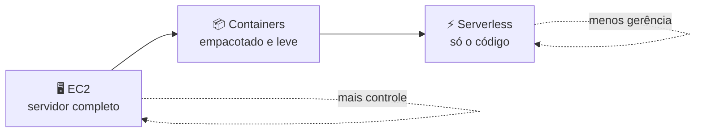
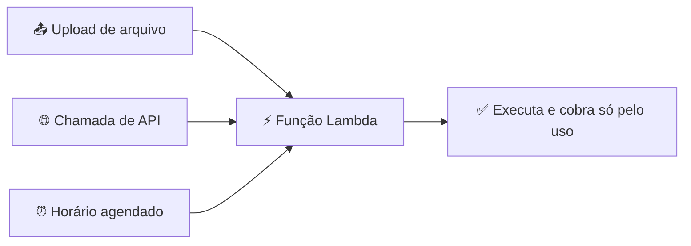

# Módulo 03 · Computação: EC2, containers e serverless

> **Nível:** 2 · Os Blocos de Construção · **Tempo estimado:** 5h · **Pré-requisitos:** Nível 1 completo

> [!NOTE]
> 📅 **No cronograma da Liga:** este módulo é peça central do **Evento 2 · O Arsenal** (Setembro/2026), que cobre os serviços core da AWS. Domínio: **CLF-C02 D3 · Cloud Technology & Services (34%)** — o maior domínio isolado das duas provas.

## 🎯 Objetivos de aprendizagem
Ao final deste módulo, você será capaz de:
- [ ] Explicar o que é o Amazon EC2 e seus modelos de preço.
- [ ] Entender o conceito de containers (ECS, EKS, Fargate).
- [ ] Compreender o modelo serverless com o AWS Lambda.
- [ ] Reconhecer o AWS Elastic Beanstalk como opção gerenciada.
- [ ] Escolher o serviço de computação certo para cada cenário.

---

## 🧠 Conteúdo

"Computação" é o poder de processamento — a parte que **executa** o seu código. A AWS oferece várias formas de obter esse poder, do mais controlável ao mais automático. Pense num **espectro de gerenciamento**:

Quanto mais à esquerda, mais **controle** (e mais responsabilidade). Quanto mais à direita, **menos você gerencia** (a AWS cuida). Escolher computação é escolher onde ficar nesse espectro.

### 1. Amazon EC2 — o servidor na nuvem

**EC2 (Elastic Compute Cloud)** é o serviço que te dá **servidores virtuais** (chamados **instâncias**) na nuvem. É como alugar um computador completo, que você liga em segundos e configura do seu jeito.

Você escolhe:
- 💪 **Tipo da instância** — quanta CPU e memória (de pequenininha a monstruosa). Há famílias otimizadas para propósito geral, computação, memória, etc.
- 💿 **AMI (Amazon Machine Image)** — o "molde" com o sistema operacional e programas.
- 🌍 **Região e AZ** — onde ela vai rodar (lembra do Módulo 01? A instância é **zonal**).

> [!TIP]
> **Analogia:** EC2 é alugar um apartamento vazio. Você tem controle total — pinta, mobilia, decide tudo — mas também é responsável por cuidar de tudo lá dentro (atualizações, segurança do SO, etc.).

#### Modelos de preço do EC2

Este é um tópico **muito cobrado na prova**. São quatro formas principais de pagar:

| Modelo | Quando usar | Vantagem |
|:--|:--|:--|
| **On-Demand** | Cargas curtas, novas ou imprevisíveis | Paga por hora/segundo, sem compromisso nem antecipação |
| **Reserved Instances (RI)** | Cargas constantes e previsíveis | Até ~72% de desconto por compromisso de 1 ou 3 anos |
| **Savings Plans** | Uso estável, com mais flexibilidade que RI | Desconto por compromisso de gasto/hora, cobre EC2, Fargate e Lambda |
| **Spot** | Tarefas que podem ser interrompidas | Até ~90% de desconto usando capacidade ociosa (some com 2 min de aviso) |

> [!IMPORTANT]
> Regra mental rápida: **imprevisível → On-Demand**; **estável e longo → Reserved/Savings**; **tolerante a interrupção → Spot**. Há ainda os **Dedicated Hosts** (servidor físico só seu, para licenças específicas), menos comuns na prova.

### 2. Containers — empacotando sua aplicação

Um **container** empacota seu app com **tudo** que ele precisa para rodar (código, bibliotecas, dependências) em uma unidade leve e portátil. Assim, ele roda **igualzinho** em qualquer lugar.

> [!NOTE]
> **Analogia:** um container é como uma marmita 🍱. Tudo que a refeição precisa vem junto, fechadinho. Você leva pra onde quiser e ela continua a mesma. (Diferente de uma VM, que seria levar a cozinha inteira.)

Na AWS:
- **Amazon ECS** — orquestrador de containers da própria AWS (mais simples de começar).
- **Amazon EKS** — o mesmo, mas usando **Kubernetes** (padrão aberto do mercado, bom para portabilidade).
- **AWS Fargate** — roda containers **sem você gerenciar servidores** (modo serverless para containers, funciona sob ECS ou EKS).

### 3. Serverless — só o seu código

**Serverless** ("sem servidor") não significa que não existem servidores — significa que **você não precisa gerenciá-los**. Você entrega só o código, e a AWS cuida de tudo: provisiona, escala e cobra apenas pela execução.

O serviço-estrela é o **AWS Lambda**: você sobe uma função, define o **evento** que a dispara (ex.: alguém subiu um arquivo, uma API foi chamada) e pronto — ela roda sozinha.

> [!TIP]
> **Analogia:** serverless é pegar um Uber 🚗. Você não compra o carro, não abastece, não estaciona. Você só pede a corrida quando precisa e paga pelo trajeto.

> [!WARNING]
> O Lambda tem um limite de **15 minutos** por execução. Ele foi feito para **reagir a eventos** rapidamente, não para rodar processos longos. Precisa de algo demorado? Volte para EC2 ou containers.

### 4. Elastic Beanstalk — o meio-termo gerenciado

E se você só quer **subir seu código** sem escolher instâncias, balanceadores e escalonamento na mão? O **AWS Elastic Beanstalk** faz isso: você envia a aplicação e ele provisiona EC2, balanceamento e auto scaling automaticamente.

> [!NOTE]
> O Beanstalk é gratuito — você paga só pelos recursos que ele cria. É uma porta de entrada PaaS: menos controle que EC2 puro, muito menos trabalho.

### 5. Qual escolher? 🤔

| Se você quer... | Use |
|:--|:--|
| Controle total sobre o servidor | 🖥️ **EC2** |
| Subir código sem configurar a infra | 🌱 **Elastic Beanstalk** |
| Portabilidade e apps modernos empacotados | 📦 **Containers (ECS/EKS/Fargate)** |
| Rodar código pontual sem gerenciar nada | ⚡ **Lambda (serverless)** |

> [!NOTE]
> Não existe "o melhor" — existe o mais adequado. Grandes sistemas costumam **combinar os quatro**.

---

## 🧪 Mão na massa (sem console!)

- 🔗 **AWS Skill Builder** → *"Compute"* no Cloud Practitioner Essentials + labs de EC2 e Lambda.
- 🔗 **AWS Builder Labs** → laboratório pré-configurado para lançar uma instância e criar uma função Lambda, **sem** conta própria.

> [!TIP]
> **Para a liderança:** no **Evento 2 (O Arsenal)**, o hands-on sugere lançar uma EC2 e uma função Lambda. Este módulo é o pré-estudo ideal para esse encontro.

---

## ❓ Quiz

<b>1. O que é uma "instância" no EC2?</b>

É um **servidor virtual** que você aluga na nuvem — um computador com CPU, memória e sistema operacional que você liga sob demanda.

<b>2. Qual modelo de preço do EC2 dá os maiores descontos para tarefas interrompíveis?</b>

O **Spot**, que usa a capacidade ociosa da AWS com até ~90% de desconto — ideal para cargas que podem ser paradas e retomadas.

<b>3. Sua aplicação roda 24/7 o ano inteiro, com carga previsível. Qual modelo economiza mais?</b>

**Reserved Instances** ou **Savings Plans** — o compromisso de 1 a 3 anos troca previsibilidade por desconto (até ~72%).

<b>4. "Serverless" significa que não há servidores?</b>

Não! Existem servidores, mas **você não os gerencia**. A AWS provisiona, escala e mantém tudo; você só cuida do seu código e paga pela execução.

<b>5. Qual o limite de tempo de uma execução do AWS Lambda, e o que isso indica?</b>

**15 minutos.** Indica que o Lambda é feito para **reagir a eventos** de forma rápida, não para processos longos. Tarefas demoradas pedem EC2 ou containers.

<b>6. Você quer só enviar seu código e deixar a AWS criar servidor, balanceador e escalonamento. Qual serviço?</b>

**AWS Elastic Beanstalk** — ele provisiona a infraestrutura automaticamente a partir do código enviado.

---

## 📔 Glossário
| Termo | Significado |
|:--|:--|
| **EC2** | Servidores virtuais (instâncias) sob demanda. |
| **AMI** | "Molde" com sistema operacional e software para uma instância. |
| **On-Demand / Reserved / Savings Plans / Spot** | Os modelos de preço do EC2. |
| **Container** | Pacote leve com app + dependências, portátil. |
| **ECS / EKS / Fargate** | Serviços da AWS para rodar containers. |
| **Serverless** | Modelo onde você não gerencia servidores. |
| **AWS Lambda** | Serviço serverless que roda funções acionadas por eventos (limite de 15 min). |
| **Elastic Beanstalk** | Serviço que provisiona a infraestrutura a partir do seu código. |

## ✅ Checklist de conclusão
- [ ] Li todo o conteúdo do módulo
- [ ] Entendi EC2 e seus quatro modelos de preço
- [ ] Compreendi containers e serverless
- [ ] Sei o limite de 15 min do Lambda e o papel do Beanstalk
- [ ] Sei escolher o serviço certo para cada caso
- [ ] Fiz o quiz
- [ ] Pratiquei em um Builder Lab

---
🏠 [Índice do Nível 2](./README.md) · ➡️ [Módulo 04 · Armazenamento](./04-armazenamento.md)
