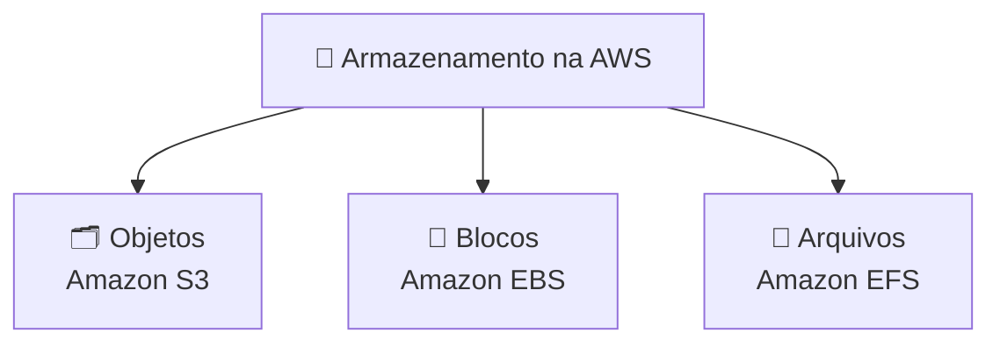

# Módulo 04 · Armazenamento: objetos, blocos e arquivos

> **Nível:** 2 · Os Blocos de Construção · **Tempo estimado:** 4h · **Pré-requisitos:** Módulo 03

## 🎯 Objetivos de aprendizagem
Ao final deste módulo, você será capaz de:
- [ ] Diferenciar armazenamento de objetos, de blocos e de arquivos.
- [ ] Entender o Amazon S3 e suas classes de armazenamento.
- [ ] Compreender o papel do EBS e do EFS.
- [ ] Escolher o tipo de armazenamento certo para cada situação.

---

## 🧠 Conteúdo

Todo sistema precisa **guardar dados** — mas nem todo dado se guarda do mesmo jeito. A AWS oferece três grandes famílias de armazenamento.

### 1. Armazenamento de objetos — Amazon S3

O **Amazon S3 (Simple Storage Service)** guarda arquivos como **objetos** dentro de **buckets** (baldes). É o mais usado da nuvem: perfeito para fotos, vídeos, backups, sites estáticos e praticamente qualquer arquivo.

Características:
- 📦 Você guarda **qualquer quantidade** de dados.
- 🌐 Cada objeto tem um endereço único (URL).
- 🛡️ Altíssima **durabilidade** (a AWS replica seus dados automaticamente).

> [!TIP]
> **Analogia:** o S3 é um guarda-volumes infinito 🎒. Você entrega um item (objeto), recebe uma etiqueta (a "chave") e pode buscá-lo a qualquer momento, de qualquer lugar.

#### Classes de armazenamento do S3
Nem todo dado é acessado com a mesma frequência — então você paga de acordo com o uso:

| Classe | Para que serve |
|:--|:--|
| **S3 Standard** | Dados acessados com frequência |
| **S3 Standard-IA** (Infrequent Access) | Dados acessados raramente, mas que precisam estar disponíveis rápido |
| **S3 Glacier** | Arquivamento de longo prazo, bem barato (acesso mais lento) |
| **S3 Intelligent-Tiering** | A AWS move seus dados automaticamente para a classe mais econômica |

### 2. Armazenamento de blocos — Amazon EBS

O **Amazon EBS (Elastic Block Store)** fornece **volumes** de disco que se conectam a uma instância EC2 — como um HD ou SSD ligado ao seu servidor. É onde ficam o sistema operacional e os dados que a instância precisa acessar rápido e constantemente.

- 🔗 Fica "grudado" a uma instância EC2.
- 📸 Você pode tirar **snapshots** (backups) dele.

> [!NOTE]
> **Analogia:** o EBS é o HD do seu computador 💽. Fica acoplado à máquina (a instância EC2) e guarda o sistema e os arquivos de trabalho dela.

### 3. Armazenamento de arquivos — Amazon EFS

O **Amazon EFS (Elastic File System)** é um sistema de arquivos **compartilhado**: **várias** instâncias EC2 podem acessar os **mesmos** arquivos ao mesmo tempo, e ele cresce e encolhe automaticamente.

> [!TIP]
> **Analogia:** o EFS é uma pasta compartilhada no Google Drive 📂 da equipe. Várias pessoas (instâncias) acessam os mesmos arquivos simultaneamente.

### 4. Qual escolher? 🤔

| Se você precisa... | Use |
|:--|:--|
| Guardar arquivos, mídia, backups, sites | 🗂️ **S3 (objetos)** |
| Um disco rápido preso a **uma** instância | 🧱 **EBS (blocos)** |
| Arquivos compartilhados entre **várias** instâncias | 📁 **EFS (arquivos)** |

---

## 🧪 Mão na massa (sem console!)

- 🔗 **AWS Skill Builder** → módulo *"Storage"* + lab de criação de bucket S3.
- 🔗 **AWS Builder Labs** → laboratório pronto para subir arquivos no S3 e explorar classes de armazenamento.

---

## ❓ Quiz

<b>1. O que é um "bucket" no S3?</b>

É o "balde"/contêiner onde você guarda seus **objetos** (arquivos) no Amazon S3. Cada objeto vive dentro de um bucket.

<b>2. Você tem backups que quase nunca serão acessados e quer pagar o mínimo. Qual classe do S3?</b>

**S3 Glacier**, feita para arquivamento de longo prazo a baixíssimo custo (com acesso mais lento).

<b>3. Qual a diferença entre EBS e EFS?</b>

O **EBS** é um disco ligado a **uma única** instância (como um HD). O **EFS** é um sistema de arquivos **compartilhado** que **várias** instâncias acessam ao mesmo tempo.

<b>4. Para hospedar as fotos de um aplicativo, qual serviço é ideal?</b>

O **Amazon S3** (armazenamento de objetos), ideal para mídia, com alta durabilidade e acesso via URL.

---

## 📔 Glossário
| Termo | Significado |
|:--|:--|
| **S3** | Armazenamento de objetos (arquivos) em buckets. |
| **Bucket** | "Balde" que contém objetos no S3. |
| **Objeto** | Um arquivo guardado no S3, com sua chave única. |
| **Classe de armazenamento** | Nível de preço/acesso do S3 (Standard, Glacier, etc.). |
| **EBS** | Disco de blocos ligado a uma instância EC2. |
| **Snapshot** | Backup de um volume EBS. |
| **EFS** | Sistema de arquivos compartilhado entre instâncias. |

## ✅ Checklist de conclusão
- [ ] Li todo o conteúdo do módulo
- [ ] Diferencio objetos, blocos e arquivos
- [ ] Conheço as classes do S3
- [ ] Sei quando usar S3, EBS ou EFS
- [ ] Fiz o quiz
- [ ] Pratiquei em um Builder Lab

---
⬅️ [Módulo 03](./03-computacao.md) · 🏠 [Índice do Nível 2](./README.md) · ➡️ [Módulo 05 · Redes](./05-redes.md)
