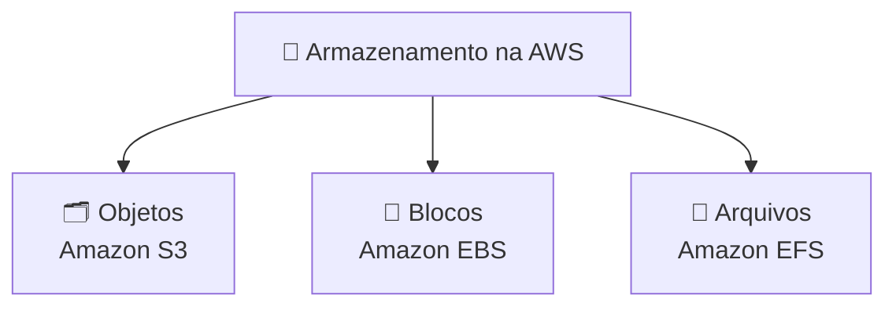

# Módulo 04 · Armazenamento: objetos, blocos e arquivos

> **Nível:** 2 · Os Blocos de Construção · **Tempo estimado:** 4h · **Pré-requisitos:** Módulo 03

> [!NOTE]
> 📅 **No cronograma da Liga:** faz parte do **Evento 2 · O Arsenal** (Setembro/2026), o encontro dos serviços core. Domínio: **CLF-C02 D3 · Cloud Technology & Services (34%)**.

## 🎯 Objetivos de aprendizagem
Ao final deste módulo, você será capaz de:
- [ ] Diferenciar armazenamento de objetos, de blocos e de arquivos.
- [ ] Entender o Amazon S3, sua durabilidade e suas classes de armazenamento.
- [ ] Compreender o papel do EBS, do EFS e do Instance Store.
- [ ] Escolher o tipo de armazenamento certo para cada situação.

---

## 🧠 Conteúdo

Todo sistema precisa **guardar dados** — mas nem todo dado se guarda do mesmo jeito. A AWS oferece três grandes famílias de armazenamento.

### 1. Armazenamento de objetos — Amazon S3

O **Amazon S3 (Simple Storage Service)** guarda arquivos como **objetos** dentro de **buckets** (baldes). É o mais usado da nuvem: perfeito para fotos, vídeos, backups, sites estáticos e praticamente qualquer arquivo.

Características:
- 📦 Você guarda **qualquer quantidade** de dados (um objeto pode ter até 5 TB).
- 🌐 Cada objeto tem um endereço único (URL).
- 🛡️ Durabilidade de **99,999999999%** — os famosos "**11 noves**". Na prática, a AWS replica cada objeto por vários dispositivos e você praticamente nunca perde um dado.

> [!TIP]
> **Analogia:** o S3 é um guarda-volumes infinito 🎒. Você entrega um item (objeto), recebe uma etiqueta (a "chave") e pode buscá-lo a qualquer momento, de qualquer lugar.

> [!IMPORTANT]
> O S3 é um serviço **regional** (seus dados ficam na Região escolhida), **mas o nome do bucket é global e único** — não podem existir dois buckets com o mesmo nome no mundo inteiro. Isso costuma cair na prova.

#### Classes de armazenamento do S3
Nem todo dado é acessado com a mesma frequência — então você paga de acordo com o uso:

| Classe | Para que serve |
|:--|:--|
| **S3 Standard** | Dados acessados com frequência |
| **S3 Standard-IA** (Infrequent Access) | Dados acessados raramente, mas que precisam estar disponíveis rápido |
| **S3 One Zone-IA** | Como o IA, mas guardado em **uma única AZ** (mais barato, menos resiliente) |
| **S3 Glacier / Glacier Deep Archive** | Arquivamento de longo prazo, bem barato (acesso mais lento, de minutos a horas) |
| **S3 Intelligent-Tiering** | A AWS move seus dados automaticamente para a classe mais econômica conforme o uso |

### 2. Armazenamento de blocos — Amazon EBS

O **Amazon EBS (Elastic Block Store)** fornece **volumes** de disco que se conectam a uma instância EC2 — como um HD ou SSD ligado ao seu servidor. É onde ficam o sistema operacional e os dados que a instância precisa acessar rápido e constantemente.

- 🔗 Fica "grudado" a uma instância EC2, dentro de **uma AZ** (é zonal).
- 📸 Você pode tirar **snapshots** (backups), que são guardados no S3.
- 💾 Os dados **persistem** mesmo se a instância for desligada.

> [!NOTE]
> **Analogia:** o EBS é o HD do seu computador 💽. Fica acoplado à máquina (a instância EC2) e guarda o sistema e os arquivos de trabalho dela.

### 3. Instance Store — o disco temporário

Algumas instâncias EC2 têm um **Instance Store**: um disco físico **anexado à máquina hospedeira**, muito rápido, porém **efêmero** — se a instância parar, **os dados somem**.

> [!WARNING]
> Nunca guarde dados importantes só no Instance Store. Ele serve para cache e arquivos temporários. Para dados que precisam sobreviver, use **EBS** ou **S3**.

### 4. Armazenamento de arquivos — Amazon EFS

O **Amazon EFS (Elastic File System)** é um sistema de arquivos **compartilhado**: **várias** instâncias EC2 podem acessar os **mesmos** arquivos ao mesmo tempo, e ele cresce e encolhe automaticamente. Diferente do EBS, o EFS é **regional** (funciona entre várias AZs).

> [!TIP]
> **Analogia:** o EFS é uma pasta compartilhada no Google Drive 📂 da equipe. Várias pessoas (instâncias) acessam os mesmos arquivos simultaneamente.

### 5. Qual escolher? 🤔

| Se você precisa... | Use |
|:--|:--|
| Guardar arquivos, mídia, backups, sites | 🗂️ **S3 (objetos)** |
| Um disco rápido e persistente preso a **uma** instância | 🧱 **EBS (blocos)** |
| Um disco temporário ultrarrápido (cache) | ⚡ **Instance Store (efêmero)** |
| Arquivos compartilhados entre **várias** instâncias | 📁 **EFS (arquivos)** |

---

## 🧪 Mão na massa (sem console!)

- 🔗 **AWS Skill Builder** → módulo *"Storage"* + lab de criação de bucket S3.
- 🔗 **AWS Builder Labs** → laboratório pronto para subir arquivos no S3 e explorar classes de armazenamento.

> [!TIP]
> **Para a liderança:** no **Evento 2 (O Arsenal)**, o hands-on de S3 combina bem com este módulo. Um exercício simples e marcante: subir uma foto no bucket e comparar as classes de armazenamento e seus custos.

---

## ❓ Quiz

<b>1. O que é um "bucket" no S3?</b>

É o "balde"/contêiner onde você guarda seus **objetos** (arquivos) no Amazon S3. Cada objeto vive dentro de um bucket, e o nome do bucket é único no mundo todo.

<b>2. Você tem backups que quase nunca serão acessados e quer pagar o mínimo. Qual classe do S3?</b>

**S3 Glacier** (ou Glacier Deep Archive), feita para arquivamento de longo prazo a baixíssimo custo, com acesso mais lento.

<b>3. Qual a diferença entre EBS e EFS?</b>

O **EBS** é um disco ligado a **uma única** instância (como um HD), dentro de uma AZ. O **EFS** é um sistema de arquivos **compartilhado**, regional, que **várias** instâncias acessam ao mesmo tempo.

<b>4. O que significa a durabilidade de "11 noves" do S3?</b>

Durabilidade de **99,999999999%**: a AWS replica cada objeto por vários dispositivos, tornando a perda de dados praticamente impossível. Durabilidade ≠ disponibilidade (esta mede se você consegue acessar agora).

<b>5. Você guardou dados no Instance Store e a instância foi parada. E os dados?</b>

**Somem.** O Instance Store é **efêmero** — some quando a instância para. Para persistir, use EBS ou S3.

---

## 📔 Glossário
| Termo | Significado |
|:--|:--|
| **S3** | Armazenamento de objetos (arquivos) em buckets; regional, com nome global único. |
| **Bucket** | "Balde" que contém objetos no S3. |
| **Objeto** | Um arquivo guardado no S3, com sua chave única. |
| **Durabilidade (11 noves)** | Probabilidade de não perder um dado (99,999999999%). |
| **Classe de armazenamento** | Nível de preço/acesso do S3 (Standard, IA, Glacier, etc.). |
| **EBS** | Disco de blocos persistente, ligado a uma instância EC2 (zonal). |
| **Instance Store** | Disco temporário e efêmero anexado ao hospedeiro. |
| **Snapshot** | Backup de um volume EBS, guardado no S3. |
| **EFS** | Sistema de arquivos compartilhado, regional, entre instâncias. |

## ✅ Checklist de conclusão
- [ ] Li todo o conteúdo do módulo
- [ ] Diferencio objetos, blocos e arquivos
- [ ] Conheço as classes do S3 e a durabilidade de 11 noves
- [ ] Sei quando usar S3, EBS, Instance Store ou EFS
- [ ] Fiz o quiz
- [ ] Pratiquei em um Builder Lab

---
⬅️ [Módulo 03](./03-computacao.md) · 🏠 [Índice do Nível 2](./README.md) · ➡️ [Módulo 05 · Redes](./05-redes.md)
