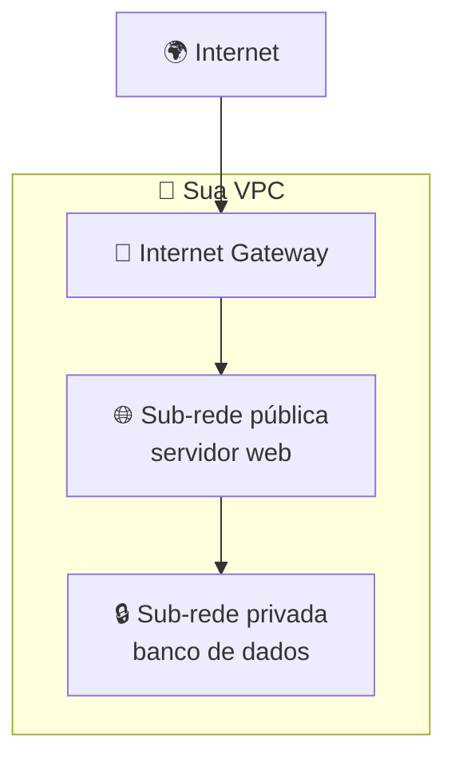
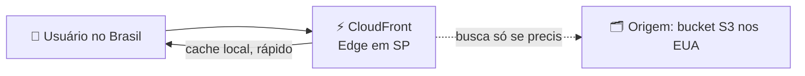

# Módulo 05 · Redes: VPC, DNS e entrega de conteúdo

> **Nível:** 2 · Os Blocos de Construção · **Tempo estimado:** 5h · **Pré-requisitos:** Módulo 04

> [!NOTE]
> 📅 **No cronograma da Liga:** faz parte do **Evento 2 · O Arsenal** (Setembro/2026) e é **revisitado com força no Bootcamp de Revisão I** (Março/2027), cujo hands-on é justamente montar uma VPC com sub-redes e Security Groups. Domínio: **CLF-C02 D3 · Cloud Technology & Services (34%)**.

## 🎯 Objetivos de aprendizagem
Ao final deste módulo, você será capaz de:
- [ ] Explicar o que é uma VPC e para que servem as sub-redes.
- [ ] Entender por que uma sub-rede é pública ou privada (é uma questão de rota!).
- [ ] Diferenciar Security Groups (stateful) de NACLs (stateless).
- [ ] Reconhecer os papéis do Internet Gateway, do NAT, do Route 53 (DNS) e do CloudFront (CDN).

---

## 🧠 Conteúdo

Redes são o que **conectam** tudo: seus servidores entre si, com a internet e com os usuários. Na AWS, sua rede privada é a **VPC**.

### 1. VPC — sua rede privada na nuvem

Uma **VPC (Virtual Private Cloud)** é uma **rede isolada e privada** só sua dentro da AWS. É como ter um "terreno cercado" onde você organiza seus recursos com segurança.

Dentro da VPC você cria **sub-redes (subnets)**, que dividem sua rede em partes:

- 🌐 **Sub-rede pública** — tem acesso à internet (ex.: o servidor web que os usuários acessam).
- 🔒 **Sub-rede privada** — **sem** acesso direto da internet (ex.: o banco de dados, que deve ficar escondido).

> [!TIP]
> **Analogia:** a VPC é um condomínio fechado 🏘️. As sub-redes públicas são as casas de frente para a rua (acessíveis); as privadas são os fundos, protegidos, onde ficam as coisas sensíveis.

### 2. O segredo: pública ou privada é uma questão de ROTA

Aqui está o ponto que confunde muita gente (e cai na prova): uma sub-rede não é pública por mágica. Ela é pública porque sua **tabela de rotas** aponta para um **Internet Gateway**.

- 🚪 **Internet Gateway (IGW)** — a "porta" que liga a VPC à internet. Uma sub-rede com rota para o IGW é **pública**.
- 🔁 **NAT Gateway** — deixa recursos de uma sub-rede **privada** iniciarem conexões **de saída** para a internet (ex.: baixar uma atualização) **sem** aceitar conexões de entrada.

> [!IMPORTANT]
> Sub-rede **pública** = tem rota para o Internet Gateway. Sub-rede **privada** = não tem. O NAT é o que permite à privada "sair" para a internet sem ficar exposta.

> [!WARNING]
> O **NAT Gateway custa dinheiro** por hora e por dados processados. Numa questão de otimização de custos, desligar NATs desnecessários é uma economia clássica (voltaremos a isso no Nível 3).

### 3. Security Groups — os porteiros (stateful)

Um **Security Group** é um **firewall virtual** que controla o tráfego que entra e sai de um recurso (como uma instância EC2). Você define regras do tipo "permitir acesso à porta 443 (HTTPS)".

> [!NOTE]
> **Analogia:** o Security Group é o porteiro 💂 de cada recurso. Ele checa uma lista e decide quem pode entrar e sair. Por padrão, ele é restritivo: só passa o que você **explicitamente** permitir. E ele é **stateful**: se você permite a entrada de uma conexão, a resposta de saída é liberada automaticamente.

> [!WARNING]
> Nunca libere acesso "para todo mundo" (0.0.0.0/0) sem necessidade — é como deixar a porta de casa escancarada. Libere apenas as portas e origens necessárias (lembra do **menor privilégio** do Módulo 02?).

### 4. NACL — o segurança do bairro (stateless)

A **NACL (Network Access Control List)** é outra camada de firewall, mas atua na **sub-rede inteira** (não em um recurso). E ela é **stateless**: você precisa permitir a entrada **e** a saída separadamente.

| | Security Group | NACL |
|:--|:--|:--|
| Atua em | Um recurso (ex.: EC2) | A sub-rede inteira |
| Estado | **Stateful** (lembra a conexão) | **Stateless** (não lembra) |
| Regras | Só permitir (allow) | Permitir **e** negar (allow/deny) |

> [!TIP]
> Pense assim: o **Security Group** é o porteiro da sua casa; a **NACL** é o guarda na entrada do bairro. A prova adora perguntar qual é stateful (SG) e qual é stateless (NACL).

### 5. Route 53 — o DNS da AWS

O **Amazon Route 53** é o serviço de **DNS**: ele traduz nomes amigáveis (como `ligasbg.com.br`) para os endereços IP dos servidores. Sem DNS, teríamos que decorar números. É um serviço **global**.

> [!TIP]
> **Analogia:** o DNS é a agenda de contatos do seu celular 📇. Você digita o **nome** ("Mãe") e ele liga para o **número** certo. O Route 53 faz isso para os sites.

### 6. CloudFront — entrega rápida de conteúdo (CDN)

O **Amazon CloudFront** é uma **CDN (Content Delivery Network)**: ele usa as **Edge Locations** (lembra do Módulo 01?) para entregar seu conteúdo a partir do ponto **mais próximo** do usuário, deixando tudo mais rápido.

> [!TIP]
> É o CloudFront que faz um vídeo começar instantaneamente, mesmo que o arquivo original esteja do outro lado do mundo.

---

## 🧪 Mão na massa (sem console!)

- 🔗 **AWS Skill Builder** → módulo *"Networking"* + lab guiado de VPC.
- 🔗 **AWS Builder Labs** → laboratório pronto para montar uma VPC com sub-redes e Security Groups, **sem** conta própria.

> [!TIP]
> **Para a liderança:** este é o módulo-chave do **Bootcamp de Revisão I (Março/2027)**, focado em CLF. Vale reservar um encontro inteiro para VPC + Security Groups, porque é onde os alunos mais tropeçam na maratona de questões.

---

## ❓ Quiz

<b>1. Para que serve uma VPC?</b>

Para criar uma **rede privada e isolada** sua dentro da AWS, onde você organiza seus recursos com segurança e controla o acesso.

<b>2. O que torna uma sub-rede "pública"?</b>

Ter, na sua **tabela de rotas**, uma rota para um **Internet Gateway**. Sem essa rota, a sub-rede é privada.

<b>3. Qual a diferença entre Security Group e NACL?</b>

O **Security Group** protege um **recurso** e é **stateful** (a resposta de uma conexão liberada volta automaticamente). A **NACL** protege a **sub-rede inteira**, é **stateless** (precisa liberar entrada e saída) e permite regras de negação.

<b>4. Um servidor numa sub-rede privada precisa baixar atualizações da internet, mas não pode receber conexões de fora. O que usar?</b>

Um **NAT Gateway**, que permite conexões **de saída** a partir da sub-rede privada sem aceitar conexões de entrada.

<b>5. Qual serviço traduz um nome de site em endereço IP? E qual deixa o site rápido no mundo todo?</b>

O **Amazon Route 53** (DNS) traduz nomes em IPs. O **Amazon CloudFront** (CDN) entrega o conteúdo pela Edge Location mais próxima de cada usuário.

---

## 📔 Glossário
| Termo | Significado |
|:--|:--|
| **VPC** | Rede privada e isolada sua dentro da AWS. |
| **Sub-rede (Subnet)** | Divisão da VPC; pública se tiver rota para o IGW, senão privada. |
| **Tabela de rotas** | Define para onde o tráfego de uma sub-rede vai (o que a torna pública/privada). |
| **Internet Gateway (IGW)** | Porta que conecta a VPC à internet. |
| **NAT Gateway** | Permite saída à internet a partir de sub-redes privadas (tem custo). |
| **Security Group** | Firewall **stateful** de um recurso. |
| **NACL** | Firewall **stateless** da sub-rede inteira. |
| **Route 53** | Serviço de DNS (global) da AWS. |
| **CloudFront** | CDN da AWS, entrega conteúdo pela borda. |

## ✅ Checklist de conclusão
- [ ] Li todo o conteúdo do módulo
- [ ] Entendi VPC e que pública/privada é questão de rota
- [ ] Sei diferenciar Security Group (stateful) e NACL (stateless)
- [ ] Conheço IGW, NAT, Route 53 e CloudFront
- [ ] Fiz o quiz
- [ ] Pratiquei em um Builder Lab

---
⬅️ [Módulo 04](./04-armazenamento.md) · 🏠 [Índice do Nível 2](./README.md) · ➡️ [Módulo 06 · Bancos de dados](./06-bancos-de-dados.md)
