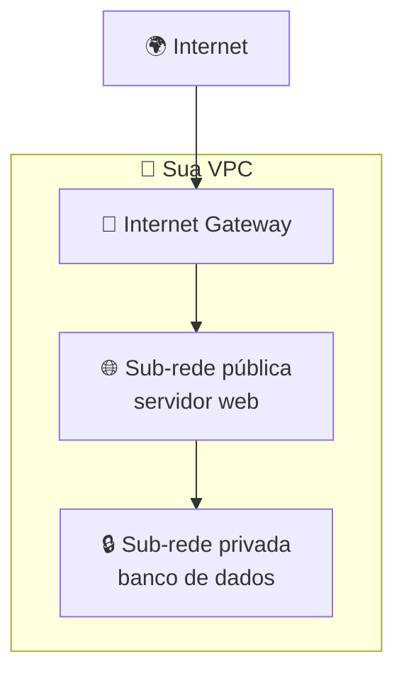
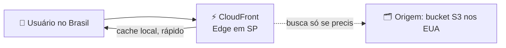

# Módulo 05 · Redes: VPC, DNS e entrega de conteúdo

> **Nível:** 2 · Os Blocos de Construção · **Tempo estimado:** 5h · **Pré-requisitos:** Módulo 04

## 🎯 Objetivos de aprendizagem
Ao final deste módulo, você será capaz de:
- [ ] Explicar o que é uma VPC e para que servem as sub-redes.
- [ ] Diferenciar sub-redes públicas e privadas.
- [ ] Entender Security Groups como "porteiros" da rede.
- [ ] Reconhecer os papéis do Route 53 (DNS) e do CloudFront (CDN).

---

## 🧠 Conteúdo

Redes são o que **conectam** tudo: seus servidores entre si, com a internet e com os usuários. Na AWS, sua rede privada é a **VPC**.

### 1. VPC — sua rede privada na nuvem

Uma **VPC (Virtual Private Cloud)** é uma **rede isolada e privada** só sua dentro da AWS. É como ter um "terreno cercado" onde você organiza seus recursos com segurança.

Dentro da VPC você cria **sub-redes (subnets)**, que dividem sua rede em partes:

- 🌐 **Sub-rede pública** — tem acesso à internet (ex.: o servidor web que os usuários acessam).
- 🔒 **Sub-rede privada** — **sem** acesso direto da internet (ex.: o banco de dados, que deve ficar escondido).

> [!TIP]
> **Analogia:** a VPC é um condomínio fechado 🏘️. As sub-redes públicas são as casas de frente para a rua (acessíveis); as privadas são os fundos, protegidos, onde ficam as coisas sensíveis.

### 2. Security Groups — os porteiros

Um **Security Group** é um **firewall virtual** que controla o tráfego que entra e sai de um recurso (como uma instância EC2). Você define regras do tipo "permitir acesso à porta 443 (HTTPS)".

> [!NOTE]
> **Analogia:** o Security Group é o porteiro 💂 de cada recurso. Ele checa uma lista e decide quem pode entrar e sair. Por padrão, ele é restritivo: só passa o que você **explicitamente** permitir.

> [!WARNING]
> Nunca libere acesso "para todo mundo" (0.0.0.0/0) sem necessidade — é como deixar a porta de casa escancarada. Libere apenas as portas e origens necessárias (lembra do **menor privilégio** do Módulo 02?).

### 3. Route 53 — o DNS da AWS

O **Amazon Route 53** é o serviço de **DNS**: ele traduz nomes amigáveis (como `ligasbg.com.br`) para os endereços IP dos servidores. Sem DNS, teríamos que decorar números.

> [!TIP]
> **Analogia:** o DNS é a agenda de contatos do seu celular 📇. Você digita o **nome** ("Mãe") e ele liga para o **número** certo. O Route 53 faz isso para os sites.

### 4. CloudFront — entrega rápida de conteúdo (CDN)

O **Amazon CloudFront** é uma **CDN (Content Delivery Network)**: ele usa as **Edge Locations** (lembra do Módulo 01?) para entregar seu conteúdo a partir do ponto **mais próximo** do usuário, deixando tudo mais rápido.

> [!TIP]
> É o CloudFront que faz um vídeo começar instantaneamente, mesmo que o arquivo original esteja do outro lado do mundo.

---

## 🧪 Mão na massa (sem console!)

- 🔗 **AWS Skill Builder** → módulo *"Networking"* + lab guiado de VPC.
- 🔗 **AWS Builder Labs** → laboratório pronto para montar uma VPC com sub-redes e Security Groups, **sem** conta própria.

---

## ❓ Quiz

<b>1. Para que serve uma VPC?</b>

Para criar uma **rede privada e isolada** sua dentro da AWS, onde você organiza seus recursos com segurança e controla o acesso.

<b>2. Onde você colocaria um banco de dados: sub-rede pública ou privada? Por quê?</b>

Em uma sub-rede **privada**, para que ele **não** fique exposto diretamente à internet, reduzindo o risco de ataques.

<b>3. O que faz um Security Group?</b>

Age como um **firewall virtual**, controlando o tráfego de entrada e saída de um recurso com base em regras que você define (quais portas e origens são permitidas).

<b>4. Qual serviço traduz um nome de site em endereço IP?</b>

O **Amazon Route 53**, o serviço de **DNS** da AWS.

<b>5. Como deixar um site rápido para usuários no mundo todo?</b>

Usando o **Amazon CloudFront** (CDN), que entrega o conteúdo a partir da Edge Location mais próxima de cada usuário.

---

## 📔 Glossário
| Termo | Significado |
|:--|:--|
| **VPC** | Rede privada e isolada sua dentro da AWS. |
| **Sub-rede (Subnet)** | Divisão da VPC; pode ser pública ou privada. |
| **Internet Gateway** | Porta que conecta a VPC à internet. |
| **Security Group** | Firewall virtual de um recurso. |
| **Route 53** | Serviço de DNS da AWS. |
| **CloudFront** | CDN da AWS, entrega conteúdo pela borda. |

## ✅ Checklist de conclusão
- [ ] Li todo o conteúdo do módulo
- [ ] Entendi VPC e sub-redes públicas/privadas
- [ ] Sei o que faz um Security Group
- [ ] Conheço Route 53 e CloudFront
- [ ] Fiz o quiz
- [ ] Pratiquei em um Builder Lab

---
⬅️ [Módulo 04](./04-armazenamento.md) · 🏠 [Índice do Nível 2](./README.md) · ➡️ [Módulo 06 · Bancos de dados](./06-bancos-de-dados.md)
