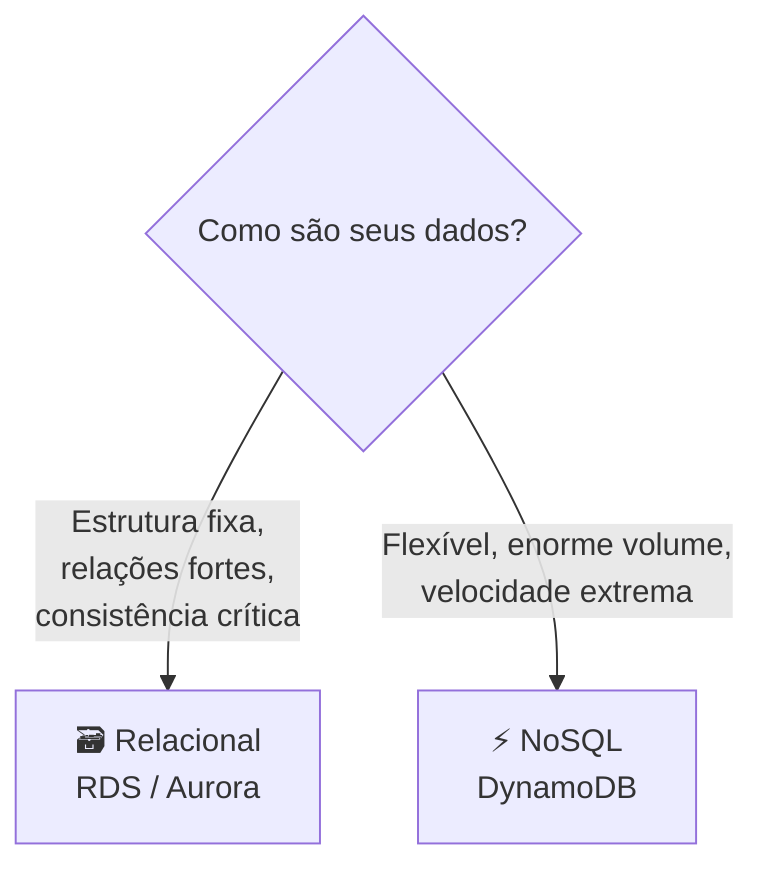

# Módulo 06 · Bancos de dados gerenciados

> **Nível:** 2 · Os Blocos de Construção · **Tempo estimado:** 4h · **Pré-requisitos:** Módulo 05

## 🎯 Objetivos de aprendizagem
Ao final deste módulo, você será capaz de:
- [ ] Diferenciar bancos de dados relacionais e NoSQL.
- [ ] Entender o que significa um banco "gerenciado".
- [ ] Conhecer RDS, Aurora e DynamoDB.
- [ ] Escolher o tipo de banco certo para cada necessidade.

---

## 🧠 Conteúdo

Quase todo sistema precisa **guardar dados organizados** para consultar depois: cadastros, pedidos, mensagens. É aí que entram os **bancos de dados**.

### 1. "Gerenciado": o que muda?

Você pode instalar e cuidar de um banco de dados sozinho dentro de uma instância EC2... mas isso dá muito trabalho (atualizações, backups, segurança, escala). Um **banco gerenciado** transfere esse trabalho pesado para a AWS.

> [!TIP]
> **Analogia:** um banco gerenciado é como morar num apartamento com **serviço de zeladoria** 🧹. Você usa o espaço; a manutenção, a segurança e os reparos são responsabilidade do prédio (a AWS).

### 2. Bancos relacionais (SQL)

Guardam dados em **tabelas** com linhas e colunas, com relações bem definidas entre elas. Usam a linguagem **SQL**. São ótimos quando os dados têm estrutura fixa e você precisa de consistência forte (ex.: sistema bancário, e-commerce).

Na AWS:
- **Amazon RDS (Relational Database Service)** — roda motores conhecidos como MySQL, PostgreSQL, MariaDB, SQL Server e Oracle, de forma gerenciada.
- **Amazon Aurora** — banco relacional da própria AWS, compatível com MySQL e PostgreSQL, com performance e disponibilidade turbinadas.

> [!NOTE]
> **Analogia:** um banco relacional é uma **planilha muito bem organizada** 📊, com regras claras de como cada informação se conecta.

### 3. Bancos NoSQL

Não usam o formato rígido de tabelas relacionais. São flexíveis, extremamente rápidos e escalam com facilidade — ótimos para grandes volumes, dados que mudam de forma, jogos, carrinhos de compra e apps de alto tráfego.

Na AWS:
- **Amazon DynamoDB** — banco NoSQL totalmente gerenciado, rápido e que escala praticamente sem limites.

> [!TIP]
> **Analogia:** um banco NoSQL é como uma **caixa de gavetas etiquetadas** 🗄️. Você guarda cada coisa do jeito que ela é (nem tudo precisa ter o mesmo formato) e encontra rapidinho pela etiqueta.

### 4. Relacional vs. NoSQL — qual usar?

| Situação | Melhor escolha |
|:--|:--|
| Sistema financeiro, ERP, e-commerce com transações | 🗃️ **Relacional (RDS / Aurora)** |
| App de altíssimo tráfego, dados flexíveis, ranking de jogo | ⚡ **NoSQL (DynamoDB)** |

> [!NOTE]
> Muitos sistemas usam **os dois**: um relacional para os dados centrais e um NoSQL para partes que exigem velocidade e escala.

### 5. Outros da família (para conhecer)
- **Amazon ElastiCache** — guarda dados em memória para acesso ultrarrápido (cache).
- **Amazon Redshift** — banco voltado a **data warehouse** (análise de grandes volumes históricos — você verá mais no Nível 5).

---

## 🧪 Mão na massa (sem console!)

- 🔗 **AWS Skill Builder** → módulo *"Databases"* + lab guiado de DynamoDB/RDS.
- 🔗 **AWS Builder Labs** → laboratório pronto para criar uma tabela e fazer consultas, **sem** conta própria.

---

## ❓ Quiz

<b>1. O que ganhamos ao usar um banco de dados "gerenciado"?</b>

A AWS assume o trabalho pesado: instalação, atualizações, backups, segurança e escala. Você foca em usar o banco, não em mantê-lo.

<b>2. Qual serviço usaria para um sistema bancário com transações e estrutura fixa?</b>

Um banco **relacional** gerenciado: **Amazon RDS** ou **Amazon Aurora**.

<b>3. Um jogo precisa de um placar global com respostas em milissegundos e volume gigante. Qual banco?</b>

**Amazon DynamoDB** (NoSQL), pela velocidade e escala praticamente ilimitada.

<b>4. Verdadeiro ou falso: um sistema só pode usar um tipo de banco.</b>

**Falso.** É comum combinar relacional e NoSQL no mesmo sistema, cada um para a parte em que é mais forte.

---

## 📔 Glossário
| Termo | Significado |
|:--|:--|
| **Banco gerenciado** | A AWS cuida da manutenção, backups, escala e segurança. |
| **Relacional (SQL)** | Dados em tabelas com relações; usa SQL. |
| **RDS** | Serviço gerenciado de bancos relacionais (MySQL, PostgreSQL, etc.). |
| **Aurora** | Banco relacional da AWS, alta performance. |
| **NoSQL** | Banco flexível e escalável, sem tabelas rígidas. |
| **DynamoDB** | Banco NoSQL gerenciado, rápido e escalável. |

## ✅ Checklist de conclusão
- [ ] Li todo o conteúdo do módulo
- [ ] Diferencio relacional e NoSQL
- [ ] Entendi o que é um banco gerenciado
- [ ] Sei escolher entre RDS/Aurora e DynamoDB
- [ ] Fiz o quiz
- [ ] Pratiquei em um Builder Lab

---
⬅️ [Módulo 05](./05-redes.md) · 🏠 [Índice do Nível 2](./README.md) · ➡️ [Nível 3 · Arquitetura e Alta Disponibilidade](../nivel-3-arquitetura-e-alta-disponibilidade/README.md)

> 🎉 **Parabéns, você concluiu o Nível 2!** Você já conhece os quatro blocos de construção da nuvem: computação, armazenamento, redes e bancos de dados. Agora é hora de aprender a montá-los como um arquiteto! 🏗️
