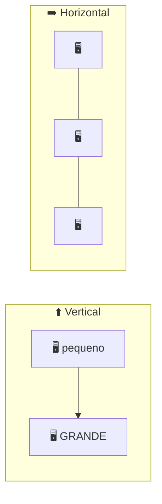
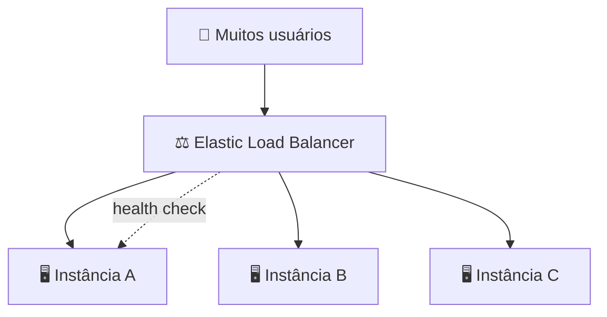
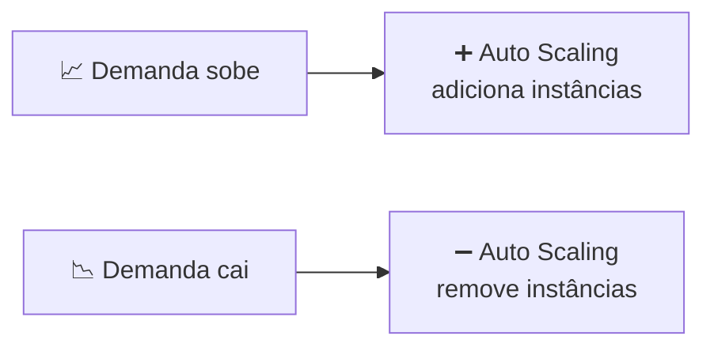

# Módulo 07 · Escalabilidade e balanceamento de carga

> **Nível:** 3 · Arquitetura e Alta Disponibilidade · **Tempo estimado:** 5h · **Pré-requisitos:** Nível 2 completo

> [!NOTE]
> 📅 **No cronograma da Liga:** conceito-chave já apresentado no **Evento 1 · A Origem** (a elasticidade como vantagem da nuvem) e aprofundado nos **Bootcamps de Revisão** (Mar–Abr/2027). Domínio: **CLF-C02 D3 · Cloud Technology & Services (34%)**.

## 🎯 Objetivos de aprendizagem
Ao final deste módulo, você será capaz de:
- [ ] Diferenciar escalabilidade vertical de horizontal.
- [ ] Explicar o que é elasticidade e por que ela é o coração da nuvem.
- [ ] Entender o papel do Elastic Load Balancer (ELB).
- [ ] Compreender como o Auto Scaling adiciona e remove instâncias sozinho.

---

## 🧠 Conteúdo

No Nível 2 você aprendeu a criar servidores. Agora vem a pergunta de arquiteto: **e quando o número de usuários explode?** Um único servidor não aguenta. A resposta é **escalar** — e fazer isso de forma automática.

### 1. Escalar para cima vs. escalar para os lados

Existem duas formas de dar mais capacidade a um sistema:

| Tipo | O que é | Analogia |
|:--|:--|:--|
| ⬆️ **Vertical (scale up)** | Trocar por uma máquina **maior** (mais CPU/RAM) | Comprar um caminhão maior |
| ➡️ **Horizontal (scale out)** | Adicionar **mais máquinas** iguais | Comprar mais caminhões |

> [!IMPORTANT]
> A nuvem prefere **escalar horizontalmente**. Adicionar máquinas iguais é mais resiliente (se uma cai, as outras seguem) e não tem "teto" como a vertical (uma máquina só pode crescer até certo ponto). Guarde isso para a prova.

### 2. Elasticidade: subir E descer, automaticamente

**Elasticidade** é a capacidade de **aumentar e diminuir** recursos conforme a demanda real — sem intervenção manual. É diferente de só "ser escalável": o elástico **também encolhe** quando a demanda cai, economizando dinheiro.

> [!TIP]
> **Analogia:** pense numa cafeteria que chama mais atendentes na hora do rush e dispensa quando esvazia 🧑‍🍳. Você paga só pela mão de obra que precisou. Na nuvem, "atendentes" são instâncias.

### 3. Elastic Load Balancer (ELB) — o distribuidor de trânsito

Se você tem várias máquinas, precisa de alguém para **distribuir os acessos** entre elas de forma justa. Esse é o **Elastic Load Balancer (ELB)**.

Ele fica na frente das instâncias e reparte o tráfego, além de checar a **saúde** de cada uma (health checks): se uma instância falha, ele para de mandar tráfego para ela.

> [!NOTE]
> Há tipos de ELB para casos diferentes: o **Application Load Balancer (ALB)** trabalha no nível de HTTP/HTTPS (ideal para sites e APIs) e o **Network Load Balancer (NLB)** trabalha em altíssima performance no nível de conexão (TCP). Para a CLF, basta saber que o ELB **distribui tráfego e faz health check**.

### 4. Auto Scaling — a mágica de crescer e encolher sozinho

O **Amazon EC2 Auto Scaling** ajusta **automaticamente** o número de instâncias com base na demanda. Você define regras (ex.: "se a CPU passar de 70%, adicione uma instância") e ele cuida do resto.

Você configura três números:
- **Mínimo** — nunca menos que isso (garante disponibilidade).
- **Desejado** — o alvo atual.
- **Máximo** — nunca mais que isso (protege o orçamento).

> [!TIP]
> **ELB + Auto Scaling é a dupla clássica** da nuvem: o Auto Scaling cria/remove instâncias conforme a carga, e o ELB distribui o tráfego entre as que existem naquele momento. Juntos, entregam elasticidade de verdade.

> [!WARNING]
> Sem um limite **máximo** bem pensado, um pico de tráfego (ou um ataque) pode fazer o Auto Scaling criar instâncias demais e estourar a conta. Definir o máximo é também uma decisão de custo.

---

## 🧪 Mão na massa (sem console!)

- 🔗 **AWS Skill Builder** → módulos sobre *"Elastic Load Balancing"* e *"EC2 Auto Scaling"* no Cloud Practitioner Essentials.
- 🔗 **AWS Builder Labs** → laboratório pronto para configurar um Load Balancer e um Auto Scaling Group, **sem** conta própria.

> [!TIP]
> **Para a liderança:** este módulo brilha nos **Bootcamps de Revisão**. Uma demonstração poderosa é mostrar um gráfico de tráfego real (ex.: Black Friday) e discutir como ELB + Auto Scaling manteriam o site no ar sem desperdício.

---

## ❓ Quiz

<b>1. Qual a diferença entre escalabilidade vertical e horizontal?</b>

**Vertical** é trocar por uma máquina maior (mais CPU/RAM). **Horizontal** é adicionar mais máquinas iguais. A nuvem prefere a horizontal, por ser mais resiliente e sem teto.

<b>2. O que diferencia "elasticidade" de apenas "ser escalável"?</b>

A elasticidade **sobe e desce** automaticamente conforme a demanda — inclusive **encolhendo** quando a carga cai, o que economiza dinheiro. Escalável, sozinho, não implica encolher.

<b>3. Para que serve o Elastic Load Balancer?</b>

Para **distribuir o tráfego** entre várias instâncias e fazer **health checks**, deixando de enviar acessos para instâncias que falharam.

<b>4. Como o Auto Scaling sabe quando adicionar ou remover instâncias?</b>

Por **regras baseadas em métricas** (ex.: uso de CPU) e pelos limites **mínimo, desejado e máximo** que você define. Ele adiciona quando a demanda sobe e remove quando cai.

<b>5. Por que ELB e Auto Scaling costumam andar juntos?</b>

Porque o **Auto Scaling** ajusta a **quantidade** de instâncias conforme a carga, e o **ELB** distribui o tráfego entre as instâncias que existem naquele momento. Juntos entregam elasticidade completa.

<b>6. Por que definir um número máximo de instâncias no Auto Scaling também é uma decisão de custo?</b>

Porque, sem limite, um pico de tráfego (ou um ataque) pode criar instâncias demais e estourar a fatura. O máximo protege o orçamento.

---

## 📔 Glossário
| Termo | Significado |
|:--|:--|
| **Escalabilidade vertical** | Aumentar o poder de uma máquina (scale up). |
| **Escalabilidade horizontal** | Adicionar mais máquinas iguais (scale out). |
| **Elasticidade** | Subir e descer recursos automaticamente conforme a demanda. |
| **Elastic Load Balancer (ELB)** | Distribui tráfego entre instâncias e faz health checks. |
| **ALB / NLB** | Tipos de ELB (aplicação/HTTP e rede/TCP). |
| **EC2 Auto Scaling** | Ajusta automaticamente o número de instâncias. |
| **Health check** | Verificação de saúde de uma instância pelo ELB. |

## ✅ Checklist de conclusão
- [ ] Li todo o conteúdo do módulo
- [ ] Diferencio escalabilidade vertical e horizontal
- [ ] Entendi elasticidade (subir E descer)
- [ ] Sei o que fazem o ELB e o Auto Scaling
- [ ] Entendi por que ELB + Auto Scaling andam juntos
- [ ] Fiz o quiz
- [ ] Pratiquei em um Builder Lab

---
🏠 [Índice do Nível 3](./README.md) · ➡️ [Módulo 08 · Alta disponibilidade e tolerância a falhas](./08-alta-disponibilidade.md)
