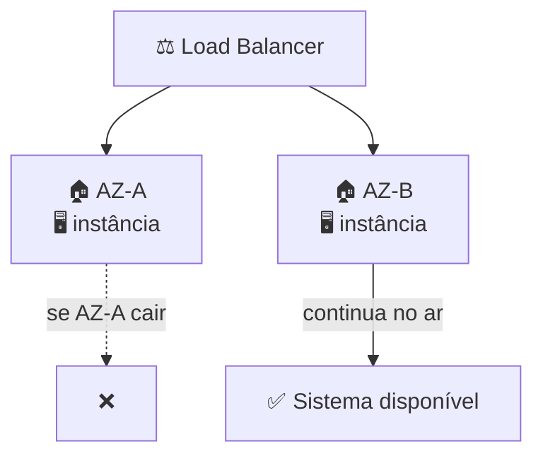
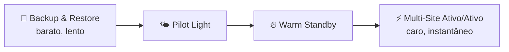

# Módulo 08 · Alta disponibilidade e tolerância a falhas

> **Nível:** 3 · Arquitetura e Alta Disponibilidade · **Tempo estimado:** 4h · **Pré-requisitos:** Módulo 07

> [!NOTE]
> 📅 **No cronograma da Liga:** conceito estruturante retomado nos **Bootcamps de Revisão** (Mar–Abr/2027), quando os alunos montam arquiteturas resilientes. Domínios: **CLF-C02 D1 · Cloud Concepts (24%)** e **D3 · Cloud Technology & Services (34%)**.

## 🎯 Objetivos de aprendizagem
Ao final deste módulo, você será capaz de:
- [ ] Diferenciar alta disponibilidade de tolerância a falhas.
- [ ] Explicar por que arquiteturas Multi-AZ são resilientes.
- [ ] Entender os conceitos de RPO e RTO.
- [ ] Reconhecer estratégias de recuperação de desastres (DR).

---

## 🧠 Conteúdo

No Módulo 07 você aprendeu a crescer sob demanda. Agora vem a outra metade do trabalho de arquiteto: **fazer o sistema não cair** — e, se algo falhar, se recuperar depressa.

### 1. Disponível vs. tolerante a falhas

Dois conceitos parecidos, mas diferentes:

- 🟢 **Alta disponibilidade (HA)** = o sistema fica no ar **quase o tempo todo**. Se um componente cai, há uma recuperação rápida (talvez com um soluço de segundos).
- 🛡️ **Tolerância a falhas (FT)** = o sistema **continua funcionando sem interrupção** mesmo com falhas — nem os usuários percebem.

> [!TIP]
> **Analogia:** alta disponibilidade é ter um pneu estepe 🛞 — se furar, você troca rápido e segue. Tolerância a falhas é ter rodas duplas no caminhão — se uma murcha, o veículo nem balança. FT é mais robusto (e mais caro) que HA.

### 2. O pilar da resiliência: múltiplas AZs

Lembra do Módulo 01, que cada Região tem no mínimo 3 Zonas de Disponibilidade isoladas? É isso que torna a alta disponibilidade possível.

> [!IMPORTANT]
> A regra de ouro da arquitetura resiliente: **nunca coloque tudo em uma única AZ.** Distribua suas instâncias, seus bancos (Multi-AZ) e seus balanceadores por **várias AZs**. Assim, a falha de uma zona inteira não derruba o sistema.

### 3. Projetando para falhar (design for failure)

Arquitetos de nuvem partem de um princípio famoso: **"tudo falha o tempo todo"**. Em vez de tentar impedir toda falha, você projeta o sistema para **aguentá-las**:

- 🔁 **Redundância** — tenha mais de uma cópia de cada coisa importante.
- 🚫 **Sem ponto único de falha (SPOF)** — nenhum componente sozinho pode derrubar tudo.
- ❤️ **Health checks e substituição automática** — o sistema detecta o que quebrou e repõe (lembra do ELB + Auto Scaling do Módulo 07?).
- 🔗 **Desacoplamento** — componentes que conversam por filas de mensagens (ex.: Amazon SQS) não travam uns aos outros.

> [!NOTE]
> Um **ponto único de falha (SPOF)** é qualquer peça que, sozinha, derruba o sistema inteiro se falhar. Eliminar SPOFs é boa parte do trabalho de resiliência.

### 4. RPO e RTO: medindo o estrago aceitável

Quando um desastre acontece, duas perguntas guiam o plano de recuperação:

| Sigla | Pergunta | Mede |
|:--|:--|:--|
| ⏮️ **RPO** (Recovery Point Objective) | "Quantos dados posso perder?" | O tempo entre o último backup e a falha |
| ⏱️ **RTO** (Recovery Time Objective) | "Quanto tempo posso ficar fora do ar?" | O tempo até voltar a funcionar |

> [!TIP]
> Jeito fácil de lembrar: **RPO olha para trás** (dados no passado que você aceita perder). **RTO olha para frente** (tempo até restabelecer). Quanto menores os dois, mais robusta — e mais cara — a arquitetura.

### 5. Estratégias de recuperação de desastres (DR)

Há um espectro de estratégias, do mais barato/lento ao mais caro/instantâneo:

| Estratégia | Ideia | Custo / Velocidade |
|:--|:--|:--|
| **Backup & Restore** | Restaura de backups quando precisa | 💲 barato / 🐢 lento |
| **Pilot Light** | Núcleo mínimo sempre ligado, resto sob demanda | 💲💲 / 🐇 |
| **Warm Standby** | Uma cópia reduzida sempre rodando | 💲💲💲 / 🏃 |
| **Multi-Site (Ativo/Ativo)** | Duas regiões ativas ao mesmo tempo | 💲💲💲💲 / ⚡ instantâneo |

> [!IMPORTANT]
> A escolha depende do RPO/RTO que o negócio exige. Um blog pode viver com Backup & Restore; um banco de verdade provavelmente precisa de Warm Standby ou Multi-Site. **Não existe escolha "certa" universal** — existe a adequada ao custo e ao risco.

---

## 🧪 Mão na massa (sem console!)

- 🔗 **AWS Skill Builder** → módulos sobre *"Reliability"* e *"High Availability"* no Cloud Practitioner Essentials.
- 🔗 **AWS Builder Labs** → laboratório pronto para configurar um banco Multi-AZ e simular a falha de uma zona, **sem** conta própria.

> [!TIP]
> **Para a liderança:** um debate excelente para os **Bootcamps** é dar um cenário ("o site da liga não pode ficar fora do ar na semana da inscrição") e pedir que os grupos escolham RPO, RTO e a estratégia de DR. Rende discussão rica sobre custo × risco.

---

## ❓ Quiz

<b>1. Qual a diferença entre alta disponibilidade e tolerância a falhas?</b>

**Alta disponibilidade** mantém o sistema no ar quase sempre, com recuperação rápida em caso de falha (pode haver um breve soluço). **Tolerância a falhas** mantém o sistema funcionando **sem interrupção alguma**, mesmo com falhas — é mais robusta e mais cara.

<b>2. Qual é a regra de ouro para tornar uma arquitetura resiliente na AWS?</b>

**Distribuir os recursos por múltiplas Zonas de Disponibilidade (AZs).** Assim, a falha de uma zona inteira não derruba o sistema.

<b>3. O que é um ponto único de falha (SPOF)?</b>

Qualquer componente que, sozinho, derruba o sistema inteiro se falhar. Eliminar SPOFs (com redundância) é essencial para a resiliência.

<b>4. O que medem o RPO e o RTO?</b>

O **RPO** mede quantos **dados** você aceita perder (olha para trás, para o último backup). O **RTO** mede quanto **tempo** você aceita ficar fora do ar (olha para frente, até a recuperação).

<b>5. Uma empresa quer recuperação quase instantânea e tem orçamento alto. Qual estratégia de DR combina?</b>

**Multi-Site (Ativo/Ativo)** — duas regiões ativas ao mesmo tempo, com recuperação praticamente instantânea, ao custo mais alto.

---

## 📔 Glossário
| Termo | Significado |
|:--|:--|
| **Alta disponibilidade (HA)** | Sistema no ar quase sempre, com recuperação rápida. |
| **Tolerância a falhas (FT)** | Sistema segue funcionando sem interrupção mesmo com falhas. |
| **Multi-AZ** | Recursos distribuídos por várias Zonas de Disponibilidade. |
| **SPOF** | Ponto único de falha; componente que derruba tudo se falhar. |
| **Desacoplamento** | Separar componentes (ex.: via filas) para que não se derrubem. |
| **RPO** | Quantos dados se aceita perder (último backup até a falha). |
| **RTO** | Quanto tempo se aceita ficar fora do ar até recuperar. |
| **Backup & Restore / Pilot Light / Warm Standby / Multi-Site** | Estratégias de DR, do mais barato/lento ao mais caro/instantâneo. |

## ✅ Checklist de conclusão
- [ ] Li todo o conteúdo do módulo
- [ ] Diferencio alta disponibilidade e tolerância a falhas
- [ ] Entendi por que distribuir em várias AZs
- [ ] Sei o que são SPOF, RPO e RTO
- [ ] Conheço as estratégias de DR e seu trade-off custo × velocidade
- [ ] Fiz o quiz
- [ ] Pratiquei em um Builder Lab

---
⬅️ [Módulo 07](./07-escalabilidade-e-balanceamento.md) · 🏠 [Índice do Nível 3](./README.md) · ➡️ [Módulo 09 · O AWS Well-Architected Framework](./09-well-architected-framework.md)
