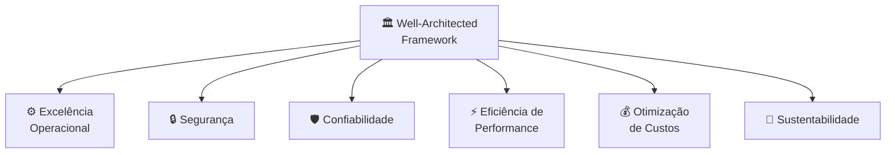

# Módulo 09 · O AWS Well-Architected Framework

> **Nível:** 3 · Arquitetura e Alta Disponibilidade · **Tempo estimado:** 4h · **Pré-requisitos:** Módulo 08

> [!NOTE]
> 📅 **No cronograma da Liga:** os pilares foram introduzidos no **Evento 1 · A Origem** como a "bússola" da boa arquitetura, e são o fio condutor de todos os **Bootcamps de Revisão**. Domínio: **CLF-C02 D1 · Cloud Concepts (24%)**.

## 🎯 Objetivos de aprendizagem
Ao final deste módulo, você será capaz de:
- [ ] Explicar o que é o AWS Well-Architected Framework e para que serve.
- [ ] Listar e descrever os 6 pilares.
- [ ] Relacionar cada pilar com serviços que você já estudou.
- [ ] Reconhecer o pilar certo a partir da descrição de um problema.

---

## 🧠 Conteúdo

Você já conhece os blocos (Nível 2) e sabe montá-los com escala e resiliência (módulos 07 e 08). Mas como saber se uma arquitetura é **boa**? A AWS criou uma "bússola" oficial para isso: o **Well-Architected Framework**.

### 1. O que é o Well-Architected Framework

É um **conjunto de boas práticas** organizado em **6 pilares**, que ajuda a projetar e revisar sistemas na nuvem. Não é uma ferramenta obrigatória: é um guia de perguntas do tipo "sua arquitetura está bem resolvida neste aspecto?".

> [!TIP]
> **Analogia:** é como a lista de verificação de segurança de um piloto ✈️ antes de decolar. Não impede você de voar, mas garante que você não esqueceu nada importante.

> [!NOTE]
> A AWS oferece a ferramenta gratuita **AWS Well-Architected Tool** no console, que faz essas perguntas e aponta melhorias. Para a prova, o importante é **conhecer os 6 pilares**.

### 2. Os 6 pilares

| Pilar | Pergunta central | Você já viu em... |
|:--|:--|:--|
| ⚙️ **Excelência Operacional** | Como opero e melhoro continuamente? | automação, monitoramento |
| 🔒 **Segurança** | Como protejo dados, sistemas e acessos? | IAM (Módulo 02) |
| 🛡️ **Confiabilidade** | Como me recupero de falhas e atendo à demanda? | HA e DR (Módulo 08) |
| ⚡ **Eficiência de Performance** | Uso os recursos de forma eficiente e moderna? | Auto Scaling, serverless (Módulos 03, 07) |
| 💰 **Otimização de Custos** | Estou pagando só pelo que preciso? | modelos de preço (próximo módulo!) |
| 🌱 **Sustentabilidade** | Minimizo o impacto ambiental do que rodo? | escolha de região, eficiência |

> [!IMPORTANT]
> Uma forma de decorar os 6 pilares: **"Só Cães Espertos Perseguem Ossos Sustentáveis"** → **S**egurança, **C**onfiabilidade, **E**xcelência operacional, **P**erformance, **O**timização de custos, **S**ustentabilidade. Use o mnemônico que fizer sentido para você.

### 3. Como os pilares se equilibram

Os pilares às vezes **puxam para lados diferentes**, e faz parte do trabalho de arquiteto equilibrá-los:

- Aumentar a **confiabilidade** (mais cópias, Multi-Site) costuma **subir o custo**.
- Priorizar **otimização de custos** ao extremo pode **reduzir performance ou resiliência**.

> [!TIP]
> Não existe arquitetura perfeita em todos os pilares ao mesmo tempo. O Well-Architected ajuda a tomar decisões **conscientes** sobre onde ceder e por quê — sempre alinhado ao que o negócio precisa.

### 4. Reconhecendo o pilar na prova

A prova costuma descrever um problema e pedir o pilar. Alguns gatilhos:

| Se a questão fala de... | Provável pilar |
|:--|:--|
| Criptografia, IAM, proteção de dados | 🔒 Segurança |
| Aguentar falhas, backups, recuperação | 🛡️ Confiabilidade |
| Automação, monitoramento, CI/CD | ⚙️ Excelência Operacional |
| Escolher o recurso certo, escalar bem | ⚡ Eficiência de Performance |
| Reduzir gastos, evitar desperdício | 💰 Otimização de Custos |
| Reduzir consumo de energia/carbono | 🌱 Sustentabilidade |

---

## 🧪 Mão na massa (sem console!)

- 🔗 **AWS Skill Builder** → módulo *"AWS Well-Architected"* no Cloud Practitioner Essentials.
- 🔗 Explore a página oficial do **Well-Architected Framework** e leia o resumo de cada pilar (só leitura, sem login).

> [!TIP]
> **Para a liderança:** um exercício ótimo para os **Bootcamps** é pegar uma arquitetura simples (ex.: o site da liga) e revisá-la pilar por pilar. Cada grupo apresenta um pilar. É didático e cai muito na prova.

---

## ❓ Quiz

<b>1. O que é o AWS Well-Architected Framework?</b>

Um **conjunto de boas práticas** organizado em 6 pilares, usado para projetar e revisar arquiteturas na nuvem. É um guia, não uma obrigação.

<b>2. Quais são os 6 pilares?</b>

**Excelência Operacional, Segurança, Confiabilidade, Eficiência de Performance, Otimização de Custos e Sustentabilidade.**

<b>3. Uma questão fala em proteger dados com criptografia e controlar acessos. Qual pilar?</b>

**Segurança** — é o pilar que trata de proteção de dados, sistemas e gestão de identidade/acesso.

<b>4. Por que os pilares às vezes entram em conflito?</b>

Porque melhorar um pode piorar outro: mais **confiabilidade** costuma custar mais, e otimizar **custos** ao extremo pode reduzir performance ou resiliência. O framework ajuda a equilibrar conscientemente.

<b>5. Uma empresa quer reduzir o consumo de energia e a pegada de carbono da sua infraestrutura. Qual pilar?</b>

**Sustentabilidade** — o pilar mais novo, focado em minimizar o impacto ambiental das cargas de trabalho.

---

## 📔 Glossário
| Termo | Significado |
|:--|:--|
| **Well-Architected Framework** | Conjunto de boas práticas em 6 pilares para arquitetar na nuvem. |
| **Excelência Operacional** | Operar, monitorar e melhorar continuamente. |
| **Segurança** | Proteger dados, sistemas e acessos. |
| **Confiabilidade** | Recuperar-se de falhas e atender à demanda. |
| **Eficiência de Performance** | Usar recursos de forma eficiente e adequada. |
| **Otimização de Custos** | Pagar só pelo necessário, sem desperdício. |
| **Sustentabilidade** | Minimizar o impacto ambiental das cargas. |
| **Well-Architected Tool** | Ferramenta gratuita da AWS que aplica o framework. |

## ✅ Checklist de conclusão
- [ ] Li todo o conteúdo do módulo
- [ ] Sei o que é o Well-Architected Framework
- [ ] Memorizei os 6 pilares
- [ ] Consigo relacionar pilares a serviços já estudados
- [ ] Sei reconhecer o pilar a partir de um problema
- [ ] Fiz o quiz
- [ ] Explorei a página oficial dos pilares

---
⬅️ [Módulo 08](./08-alta-disponibilidade.md) · 🏠 [Índice do Nível 3](./README.md) · ➡️ [Módulo 10 · Otimização de custos](./10-otimizacao-de-custos.md)
