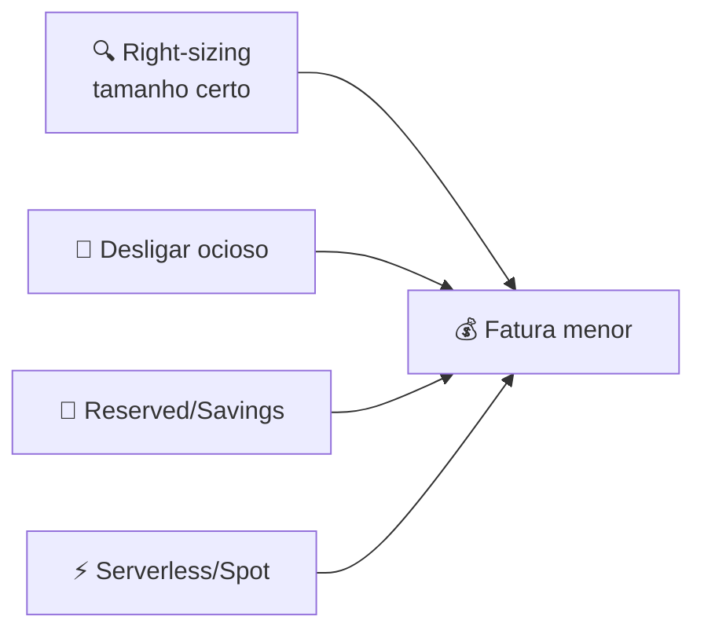

# Módulo 10 · Otimização de custos

> **Nível:** 3 · Arquitetura e Alta Disponibilidade · **Tempo estimado:** 3h · **Pré-requisitos:** Módulo 09

> [!NOTE]
> 📅 **No cronograma da Liga:** tema central do **Evento 4 · Escudo & Cofre** (Novembro/2026), que junta segurança e custos, com apoio do **Evento 2 · O Arsenal** (modelos de preço). Domínio: **CLF-C02 D4 · Billing, Pricing & Support (12%)**.

## 🎯 Objetivos de aprendizagem
Ao final deste módulo, você será capaz de:
- [ ] Explicar os princípios de precificação da AWS.
- [ ] Reconhecer as ferramentas de custo (Cost Explorer, Budgets, Billing).
- [ ] Aplicar boas práticas de economia (right-sizing, desligar ocioso).
- [ ] Entender os planos de suporte da AWS.

---

## 🧠 Conteúdo

Você já sabe arquitetar sistemas escaláveis e resilientes. Falta o pilar que o financeiro mais cobra: **pagar só o necessário**. Este módulo fecha o Nível 3 conectando arquitetura e dinheiro.

### 1. Os 3 princípios de preço da AWS

Quase tudo na AWS segue três ideias:

- 💧 **Pague pelo que usar** — sem contratos longos obrigatórios; ligou, pagou; desligou, parou de pagar.
- 📉 **Pague menos reservando** — comprometa-se com uso (Reserved / Savings Plans) e ganhe desconto.
- 📦 **Pague menos usando mais** — quanto mais você consome (ex.: armazenamento), menor o preço por unidade (economia de escala).

> [!TIP]
> Isso reforça a ideia do Módulo 00: a nuvem troca **CapEx** (grande gasto inicial) por **OpEx** (gasto variável). Otimizar custos é, em boa parte, **desligar o que não está em uso**.

### 2. O que costuma pesar na fatura

Em geral, você paga por três coisas principais:

| Custo | Exemplo |
|:--|:--|
| 🖥️ **Computação** | Horas de instâncias EC2, execuções de Lambda |
| 💾 **Armazenamento** | GBs no S3, volumes EBS |
| 🌐 **Transferência de dados** | Dados **saindo** da AWS para a internet |

> [!IMPORTANT]
> Regra que surpreende muita gente: **dados entrando** na AWS costumam ser **gratuitos**, mas dados **saindo** para a internet são **cobrados**. Arquitetar para reduzir tráfego de saída (ex.: cache no CloudFront) também economiza.

### 3. As ferramentas de custo

A AWS dá um "painel financeiro" para você não tomar susto na fatura:

| Ferramenta | Para que serve |
|:--|:--|
| 🧾 **AWS Billing Dashboard** | Ver a fatura atual e o histórico |
| 📊 **AWS Cost Explorer** | Visualizar e analisar gastos ao longo do tempo |
| 🔔 **AWS Budgets** | Definir um orçamento e receber **alertas** ao se aproximar do limite |
| 🏷️ **Cost Allocation Tags** | Etiquetar recursos para saber quanto cada projeto/time gasta |

> [!TIP]
> **Analogia:** o **Cost Explorer** é o extrato do banco (mostra para onde o dinheiro foi). O **Budgets** é o alerta do app do banco ("você já gastou 80% do limite"). Um analisa o passado; o outro protege o futuro.

### 4. Boas práticas de economia

- 🔍 **Right-sizing** — use a instância do tamanho certo; máquinas superdimensionadas queimam dinheiro parado.
- 🔌 **Desligar o ocioso** — ambientes de teste podem dormir à noite e nos fins de semana. Lembra do NAT Gateway do Módulo 05? Desligar o desnecessário conta.
- 📄 **Compromisso** — para cargas estáveis, Reserved Instances ou Savings Plans cortam bastante.
- ⚡ **Modelos elásticos** — serverless (paga por execução) e Spot (capacidade ociosa barata) reduzem desperdício.

> [!NOTE]
> Isto é literalmente o pilar **Otimização de Custos** do Well-Architected (Módulo 09) na prática. Arquitetura boa e conta enxuta andam juntas.

### 5. Planos de suporte da AWS

Quando algo dá errado, o nível de ajuda depende do plano contratado:

| Plano | Para quem | Destaque |
|:--|:--|:--|
| **Basic** | Todos (grátis) | Documentação, fóruns, alguns checks do Trusted Advisor |
| **Developer** | Quem está experimentando | Suporte técnico por e-mail, horário comercial |
| **Business** | Cargas de produção | Suporte 24/7, tempos de resposta mais rápidos |
| **Enterprise** | Missão crítica | 24/7, **Technical Account Manager (TAM)** dedicado |

> [!TIP]
> O **AWS Trusted Advisor** analisa sua conta e dá recomendações em 5 categorias, incluindo **otimização de custos** e **segurança**. Nos planos Business e Enterprise, ele libera todas as verificações.

---

## 🧪 Mão na massa (sem console!)

- 🔗 **AWS Skill Builder** → módulos sobre *"Billing and Pricing"* e *"Support Plans"* no Cloud Practitioner Essentials.
- 🔗 Explore a **AWS Pricing Calculator** no site oficial para estimar o custo de uma arquitetura (sem login).

> [!TIP]
> **Para a liderança:** no **Evento 4 (Escudo & Cofre)**, monte um desafio: dado um cenário simples, os grupos usam a Pricing Calculator para estimar o custo e propõem 3 economias. Conecta o D4 (custos) ao pilar de custos do Well-Architected.

---

## ❓ Quiz

<b>1. Quais são os três princípios de preço da AWS?</b>

**Pague pelo que usar**, **pague menos ao reservar** (compromisso) e **pague menos ao usar mais** (economia de escala).

<b>2. Dados entrando na AWS são cobrados? E dados saindo para a internet?</b>

**Entrada** costuma ser **gratuita**; **saída** para a internet é **cobrada**. Por isso, reduzir tráfego de saída (ex.: cache no CloudFront) economiza.

<b>3. Qual a diferença entre o Cost Explorer e o AWS Budgets?</b>

O **Cost Explorer** analisa gastos passados (como um extrato). O **AWS Budgets** define um limite e **alerta** quando você se aproxima dele (protege o futuro).

<b>4. Cite duas boas práticas para reduzir a fatura.</b>

Quaisquer duas entre: **right-sizing** (tamanho certo), **desligar recursos ociosos**, usar **Reserved/Savings Plans** para cargas estáveis e adotar **serverless/Spot** para reduzir desperdício.

<b>5. Uma empresa de missão crítica precisa de suporte 24/7 com um gerente técnico dedicado. Qual plano?</b>

**Enterprise** — oferece suporte 24/7 e um **Technical Account Manager (TAM)** dedicado.

<b>6. Qual ferramenta analisa sua conta e recomenda melhorias em custos, segurança e mais?</b>

O **AWS Trusted Advisor** — dá recomendações em 5 categorias; nos planos Business e Enterprise, todas as verificações ficam disponíveis.

---

## 📔 Glossário
| Termo | Significado |
|:--|:--|
| **Pague pelo que usar** | Princípio central: sem contrato obrigatório, paga o consumo. |
| **Transferência de dados** | Custo de dados saindo da AWS (entrada costuma ser grátis). |
| **Cost Explorer** | Ferramenta para analisar gastos ao longo do tempo. |
| **AWS Budgets** | Define orçamentos e envia alertas de custo. |
| **Right-sizing** | Ajustar o recurso ao tamanho realmente necessário. |
| **Planos de suporte** | Basic, Developer, Business, Enterprise. |
| **Trusted Advisor** | Ferramenta que recomenda melhorias (custos, segurança, etc.). |
| **TAM** | Technical Account Manager, dedicado no plano Enterprise. |

## ✅ Checklist de conclusão
- [ ] Li todo o conteúdo do módulo
- [ ] Entendi os 3 princípios de preço
- [ ] Sei diferenciar Cost Explorer e Budgets
- [ ] Conheço boas práticas de economia (right-sizing, desligar ocioso)
- [ ] Conheço os 4 planos de suporte
- [ ] Fiz o quiz
- [ ] Explorei a Pricing Calculator

---
⬅️ [Módulo 09](./09-well-architected-framework.md) · 🏠 [Índice do Nível 3](./README.md) · ➡️ [Nível 4 · Segurança e Operações](../nivel-4-seguranca-e-operacoes/README.md)

> 🎉 **Parabéns, você concluiu o Nível 3!** Você já pensa como um arquiteto de nuvem: sabe escalar, tornar resiliente, avaliar pelos 6 pilares e controlar custos. A base para a certificação está sólida. Bora construir! 🚀
